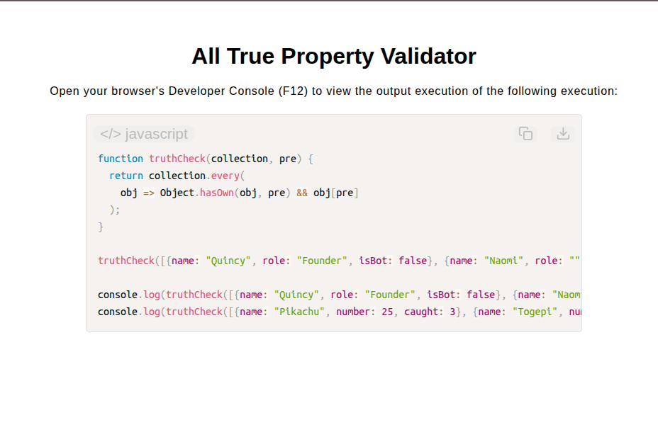

# All-True Property Validator

[Live Demo](https://tefol-hub.github.io/freeCodeCamp-Projects-and-Certs/Javascript-Certification/all-true-property-validator/)
[Lab Instructions](https://www.freecodecamp.org/learn/javascript-v9/lab-all-true-property-validator/build-an-all-true-property-validator)

## 📸 Preview

## 🎯 Project Goals
* **Objective:** Verify whether a specific target property evaluates to a truthy value across every object in a collection array.
* **Higher-Order Array Validation:** Utilized `Array.prototype.every()` to perform boolean assertion testing across all collection elements.
* **Property Existence & Truthiness Checks:** Combined `Object.hasOwn()` property checks with bracket access evaluation to detect falsy values (`false`, `0`, `""`, `null`, `undefined`, `NaN`).
* **Short-Circuit Logical Evaluation:** Optimized runtime performance by short-circuiting as soon as a falsy property state is detected.

## 🛠️ Technologies Used
* **JavaScript (ES6):** Higher-Order Functions (`.every()`), `Object.hasOwn()`, bracket notation property access, truthy/falsy assertion.
* **HTML5 & CSS3:** Presentational user display framework.
* **Prism.js:** Automated syntax parsing and client-side code rendering.

## 🚀 How to Run
1. Navigate to: `cd Javascript-Certification/all-true-property-validator`
2. Open `index.html` in your browser.
3. Access your **Developer Console (F12)** to test property truthiness validation across custom object arrays.
