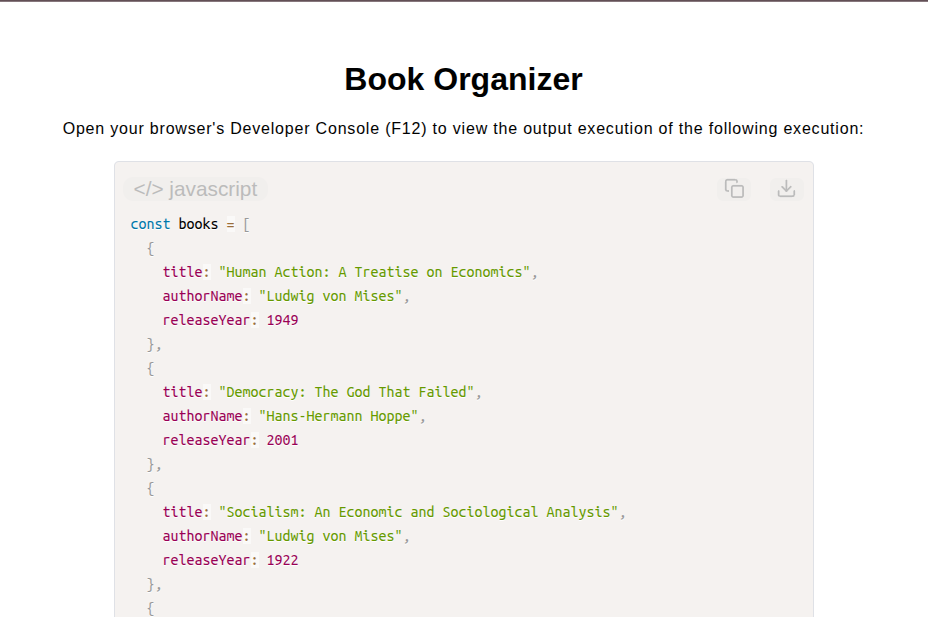

# Book Organizer

[Live Demo](https://tefol-hub.github.io/freeCodeCamp-Projects-and-Certs/Javascript-Certification/book-organizer/)
[Lab Instructions](https://www.freecodecamp.org/learn/javascript-v9/lab-book-organizer/build-a-book-organizer)

## 📸 Preview

## 🎯 Project Goals
* **Objective:** Parse a collection of literary catalog objects, filter out items post-dating a designated cutoff year, and sort the remaining items chronologically by release year.
* **Higher-Order Filtering:** Utilized `Array.prototype.filter()` to non-mutatively extract book objects released on or before 1950.
* **Custom Comparator Callback:** Built a `sortByYear` callback function returning standard comparison flags (`-1`, `1`, `0`) based on object property evaluation.
* **In-Place Array Sorting:** Passed the custom comparator callback into `Array.prototype.sort()` to organize filtered items in ascending order.

## 🛠️ Technologies Used
* **JavaScript (ES6):** Objects, Higher-Order Functions (`.filter()`, `.sort()`), ternary operator chains, array callbacks.
* **HTML5 & CSS3:** Presentational user display framework.
* **Prism.js:** Automated syntax parsing and client-side code rendering.

## 🚀 How to Run
1. Navigate to: `cd Javascript-Certification/book-organizer`
2. Open `index.html` in your browser.
3. Access your **Developer Console (F12)** to test custom book catalogs and cutoff dates.
