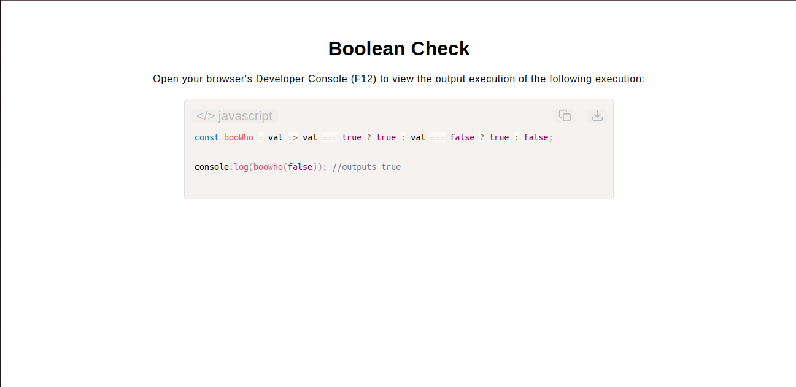

# Boolean Check Function

[Live Demo](https://tefol-hub.github.io/freeCodeCamp-Projects-and-Certs/Javascript-Certification/boolean-check/)
[Lab Instructions](https://www.freecodecamp.org/learn/javascript-v9/lab-boolean-check/build-a-boolean-check-function)

## 📸 Preview

## 🎯 Project Goals
* **Objective:** Design and build a standalone validator utility function to verify if an incoming argument matches a boolean primitive type.
* **Arrow Functions:** Implemented clean modern ES6 implicit return arrow function syntax (`const functionName = arg => expression`).
* **Strict Comparison:** Utilized explicit identity evaluation (`===`) to run defensive type-checking boundaries, ensuring falsy values do not erroneously pass validation rules.

## 🛠️ Technologies Used
* **JavaScript (ES6):** Arrow functions, strict identity comparisons, and ternary operations.
* **HTML5 & CSS3:** Structural presentational layout container framework.
* **Prism.js:** Client-side syntax styling formatting engine.

## 🚀 How to Run
1. Navigate to: `cd JavaScript-Certification/boolean-check`
2. Open `index.html` in your browser.
3. Access your browser's **Developer Console (F12)** to test different input parameters via invocation calls.
