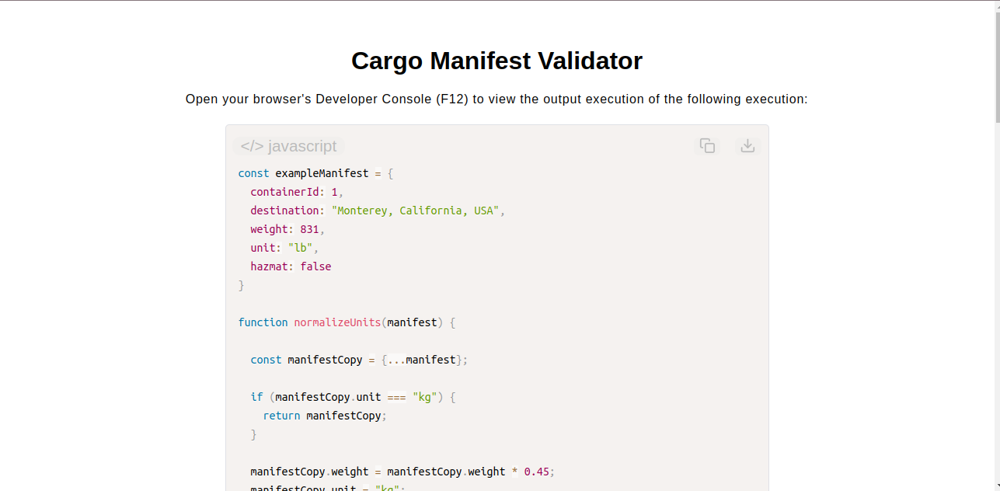

# Cargo Manifest Validator

[Live Demo](https://tefol-hub.github.io/freeCodeCamp-Projects-and-Certs/Javascript-Certification/cargo-manifest-validator/)
[Lab Instructions](https://www.freecodecamp.org/learn/javascript-v9/lab-cargo-manifest-validator/lab-cargo-manifest-validator)

## 📸 Preview

## 🎯 Project Goals
* **Objective:** Create an asset-auditing pipeline system that ingests, sanitizes, scales, and validates nested cargo dataset structures while avoiding state mutation errors.
* **Non-Mutating Record Normalization:** Utilized the ES6 object spread operator (`{ ...manifest }`) to successfully clone properties into a new data boundary, performing calculation scalings (e.g., converting pounds (`lb`) to kilograms (`kg`)) safely on copies.
* **Property Containment Auditing:** Used explicit conditional containment properties (`key in object` or `.hasOwnProperty()`) to systematically check for fields like `containerId`, `destination`, `weight`, `unit`, and `hazmat`.
* **Dynamic Exception Logging:** Generated explicit decoupled error mapping structures to collect and isolate type mismatches, missing values, or invalid ranges (e.g., non-integer container IDs or negative weights).

## 🛠️ Technologies Used
* **JavaScript (ES6):** Object clone structures (`{ ...spread }`), property lookups, state containment methods, string trimming, and numeric sanitization validations.
* **HTML5 & CSS3:** Presentational dashboard design framework.
* **Prism.js:** Client-side source block formatting and runtime code preview configurations.

## 🚀 How to Run
1. Navigate to: `cd Javascript-Certification/cargo-manifest-validator`
2. Open `index.html` in your browser.
3. Access your **Developer Console (F12)** to inspect the validation object payloads and tracking summaries.
