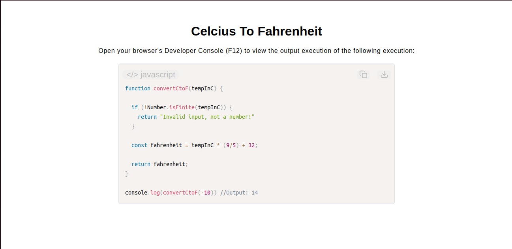

# Celsius to Fahrenheit Converter

[Live Demo](https://tefol-hub.github.io/freeCodeCamp-Projects-and-Certs/Javascript-Certification/celsius-to-fahrenheit/)
[Lab Instructions](https://www.freecodecamp.org/learn/javascript-v9/lab-celsius-to-fahrenheit-converter/build-a-celsius-to-fahrenheit-converter)

## 📸 Preview

## 🎯 Project Goals
* **Objective:** Create a mathematical algorithm function capable of translating raw Celsius input parameters into explicit Fahrenheit metrics.
* **Algorithmic Arithmetic:** Implemented standard linear transformation steps using formula precedence grouping arrays.
* **Strict Parameter Filtering:** Deployed `Number.isFinite()` inside a guard condition to cleanly separate computational numbers from bad inputs or infinite values.

## 🛠️ Technologies Used
* **JavaScript (ES6):** Number methods (`.isFinite()`), function parameters, and numeric evaluation.
* **HTML5 & CSS3:** Presentational dashboard design mockup layout.
* **Prism.js:** On-the-fly client side code presentation formatting.

## 🚀 How to Run
1. Navigate to: `cd JavaScript-Certification/celsius-to-fahrenheit`
2. Open `index.html` in your browser.
3. Access your **Developer Console (F12)** to test input conversions using custom numeric invocations.
