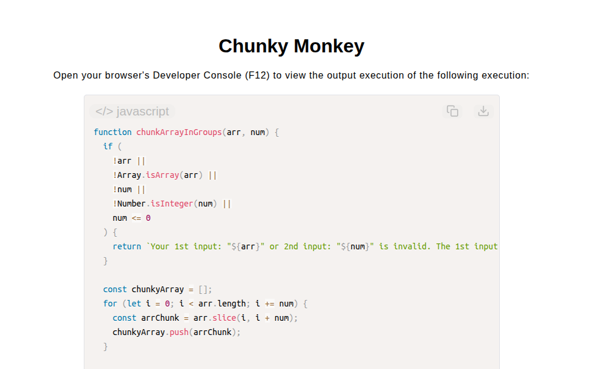

# Chunky Monkey Algorithm

[Live Demo](https://tefol-hub.github.io/freeCodeCamp-Projects-and-Certs/Javascript-Certification/chunky-monkey/)
[Lab Instructions](https://www.freecodecamp.org/learn/javascript-v9/lab-chunky-monkey/implement-the-chunky-monkey-algorithm)

## 📸 Preview

## 🎯 Project Goals
* **Objective:** Divide an array into smaller sub-array chunks of specified maximum length ($size = n$) and return the resulting two-dimensional matrix.
* **Variable-Stride Iteration:** Stepped through array indices using custom loop increments (`i += num`) to systematically mark chunk boundary offsets.
* **Non-Mutating Array Slicing:** Extracted windowed elements using `Array.prototype.slice(i, i + num)` to construct sub-arrays without altering input state.
* **Strict Parameter Auditing:** Guarded against non-array targets, non-integer slice sizes, zero, and negative interval arguments.

## 🛠️ Technologies Used
* **JavaScript (ES6):** Loop stride control (`i += num`), non-mutating slicing (`.slice()`), matrix operations, and input validation (`Array.isArray`, `Number.isInteger`).
* **HTML5 & CSS3:** Presentational user display framework.
* **Prism.js:** Automated syntax parsing and client-side code rendering.

## 🚀 How to Run
1. Navigate to: `cd Javascript-Certification/chunky-monkey`
2. Open `index.html` in your browser.
3. Open your browser's **Developer Console (F12)** to test custom array partitioning with various chunk size arguments.
