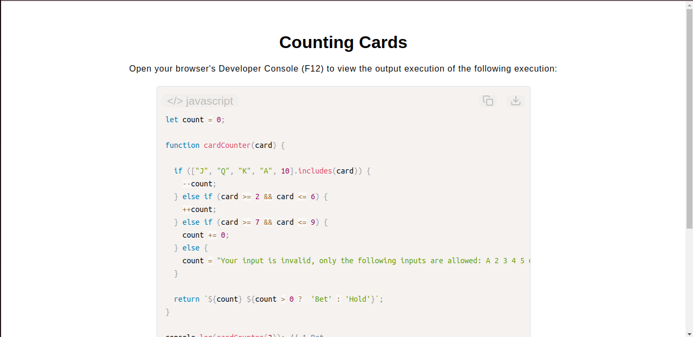

# Card Counting Assistant

[Live Demo](https://tefol-hub.github.io/freeCodeCamp-Projects-and-Certs/Javascript-Certification/counting-cards/)
[Lab Instructions](https://www.freecodecamp.org/learn/javascript-v9/lab-counting-cards/lab-counting-cards)

## 📸 Preview

## 🎯 Project Goals
* **Objective:** Build a data tracking algorithm that manages a global running count score to assist with card counting choices in Blackjack.
* **Global State Management:** Managed tracking transitions over a persistent global integer state value (`count`) modified across separate functional invocations.
* **Hybrid Data Filtering:** Combined precise array lookup boundaries (`.includes()`) with dynamic mathematical range filtering (`card >= 2 && card <= 6`) to handle mixed inputs of numeric types and face-card strings.
* **Dynamic Evaluation Rules:** Dispatched a conditional ternary output string compiling both the internal structural tally state and a tactical game recommendation (`Bet` vs. `Hold`).

## 🛠️ Technologies Used
* **JavaScript (ES6):** Global scope mutation, array containment checks, comparison evaluation, and template literals.
* **HTML5 & CSS3:** Presentational document view architecture.
* **Prism.js:** Code snippet styling and highlighting utility.

## 🚀 How to Run
1. Navigate to: `cd Javascript-Certification/counting-cards`
2. Open `index.html` in your browser.
3. Access your browser's **Developer Console (F12)** to run test hands sequentially and witness the real-time adjustments of the betting recommendations.
