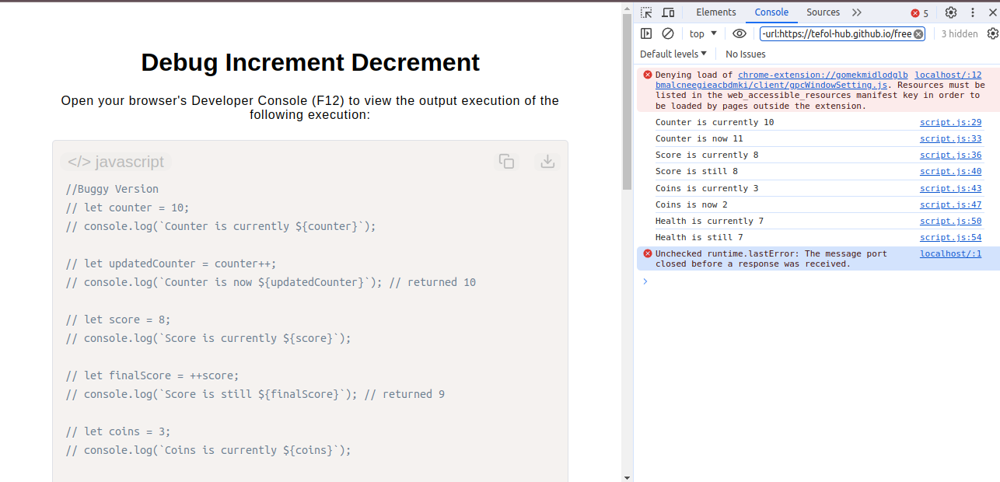

# Debug Increment Decrement

[Live Demo](https://tefol-hub.github.io/freeCodeCamp-Projects-and-Certs/Javascript-Certification/debug-increment-decrement/)
[Lab Instructions](https://www.freecodecamp.org/learn/javascript-v9/lab-debug-increment-and-decrement-operator-errors/debug-increment-and-decrement-operator-errors-in-a-buggy-app)

## 📸 Preview

## 🎯 Project Goals
* **Objective:** Master the structural behavioral differences between prefix and postfix evaluation patterns for unary increment (`++`) and decrement (`--`) operators.
* **Evaluation Ordering:** Fixed computational side-effects by switching between pre-evaluation increments/decrements and post-evaluation mutations based on intended assignment behavior.
* **State Management:** Corrected inline state evaluation tracking errors across common game-logic data points like counters, scores, coins, and health values.

## 🛠️ Technologies Used
* **JavaScript (ES6):** Prefix vs. Postfix unary operators, numeric assignments, and literal string interpolation.
* **HTML5 & CSS3:** Scaffolding setup for embedding runtime scripts into browser views.
* **Prism.js:** Asynchronous DOM source-code injection and theme rendering syntax utility.

## 🚀 How to Run
1. Navigate to: `cd JavaScript-Certification/debug-increment-decrement`
2. Open `index.html` in your browser.
3. Launch your browser's **Developer Console (F12)** to inspect the correct linear progression of structural counter state alterations.