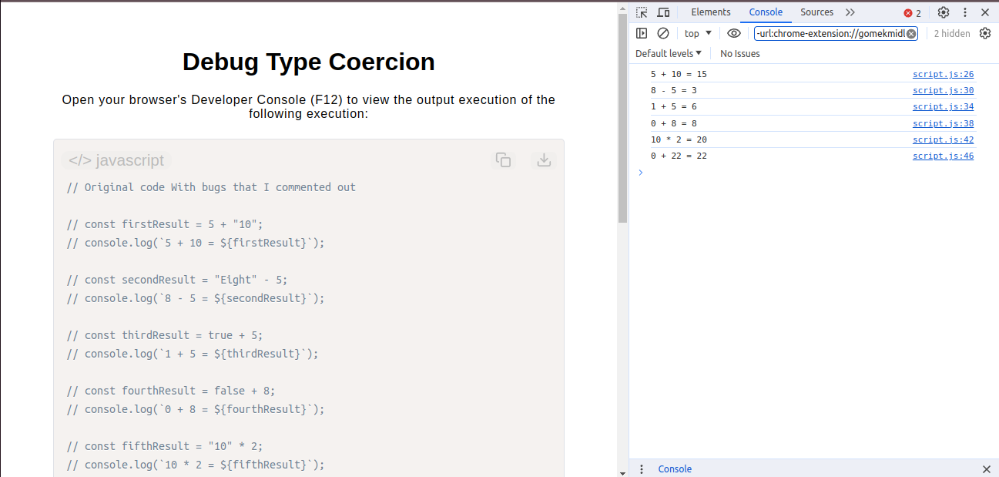

# Debug Type Coercion

[Live Demo](https://tefol-hub.github.io/freeCodeCamp-Projects-and-Certs/Javascript-Certification/debug-type-coercion/)
[Lab Instructions](https://www.freecodecamp.org/learn/javascript-v9/lab-debug-type-coercion-errors/debug-type-coercion-errors-in-a-buggy-app)

## 📸 Preview

## 🎯 Project Goals
* **Objective:** Identify, understand, and neutralize implicit data type coercion bugs in mathematical operations.
* **Type Safety:** Replaced implicit coercions (e.g., string/boolean addition) with explicit, mathematically valid number types.
* **Mathematical Integrity:** Eradicated silent frontend logical errors like string concatenation bugs (`5 + "10" = "510"`) and invalid numeric states (`NaN`).
* **Clean Code Practices:** Maintained clear inline documentation outlining the underlying bug behaviors alongside their explicit typing resolutions.

## 🛠️ Technologies Used
* **JavaScript (ES6):** Data types (Numbers, Strings, Booleans, Null), string interpolation, and explicit mathematical evaluation.
* **HTML5 & CSS3:** Semantic content container configuration.
* **Prism.js:** Asynchronous structural source code layout formatting.

## 🚀 How to Run
1. Navigate to: `cd JavaScript-Certification/debug-type-coercion`
2. Open `index.html` in your browser.
3. Open your browser's **Developer Console (F12)** to view the explicitly calculated numerical logs.