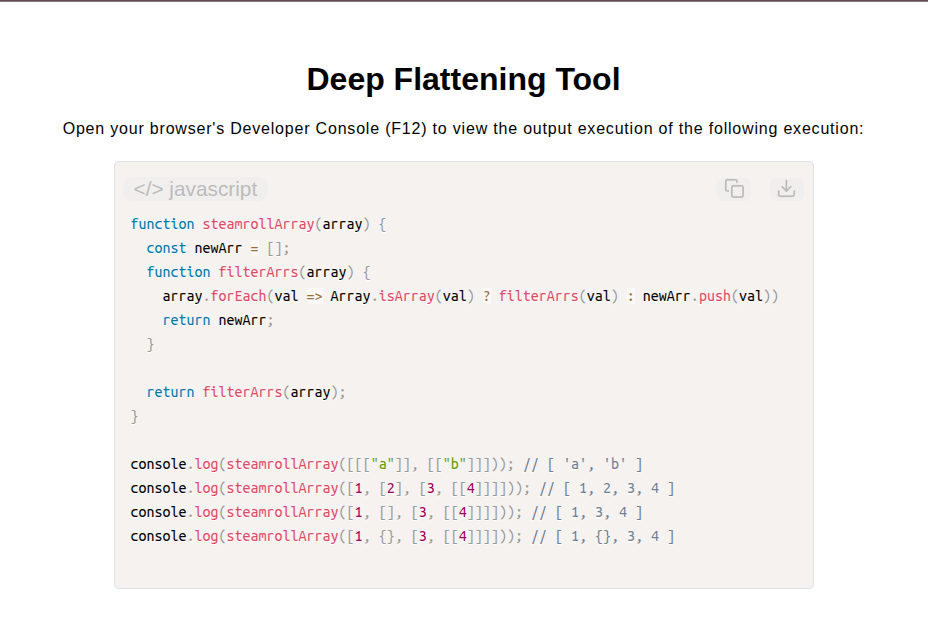

# Deep Flattening Tool

[Live Demo](https://tefol-hub.github.io/freeCodeCamp-Projects-and-Certs/Javascript-Certification/deep-flattening-tool/)
[Lab Instructions](https://www.freecodecamp.org/learn/javascript-v9/lab-deep-flattening-tool/create-a-deep-flattening-tool)

## 📸 Preview

## 🎯 Project Goals
* **Objective:** Unroll multi-dimensional arrays of arbitrary nesting depth into a single, one-dimensional array without relying on `Array.prototype.flat()`.
* **Recursive Array Extraction:** Constructed an inner recursive helper function to traverse nested array branches of arbitrary depth.
* **Higher-Order Array Iteration:** Utilized `Array.prototype.forEach()` to process individual items and determine structural array types using `Array.isArray()`.
* **Pure Scope Management:** Encapsulated storage arrays inside function local scope to prevent global variable pollution across multiple invocations.

## 🛠️ Technologies Used
* **JavaScript (ES6):** Higher-Order Functions (`.forEach()`), recursion, `Array.isArray()` structural type checks, closure scope.
* **HTML5 & CSS3:** Presentational user display framework.
* **Prism.js:** Automated syntax parsing and client-side code rendering.

## 🚀 How to Run
1. Navigate to: `cd Javascript-Certification/deep-flattening-tool`
2. Open `index.html` in your browser.
3. Access your **Developer Console (F12)** to test deeply nested array flattening.
