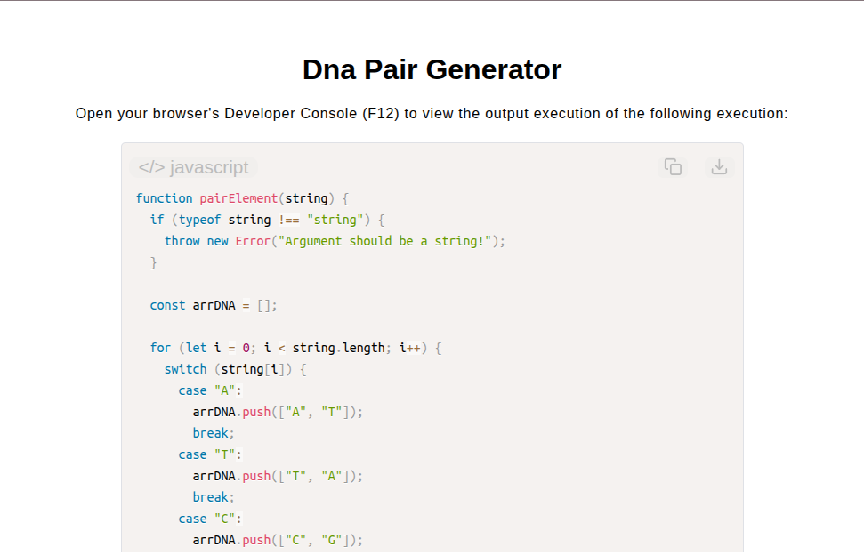

# DNA Pair Generator

[Live Demo](https://tefol-hub.github.io/freeCodeCamp-Projects-and-Certs/Javascript-Certification/dna-pair-generator/)
[Lab Instructions](https://www.freecodecamp.org/learn/javascript-v9/lab-dna-pair-generator/implement-a-dna-pair-generator)

## 📸 Preview

## 🎯 Project Goals
* **Objective:** Parse a string of single-character DNA bases and construct a two-dimensional array pairing each base with its complementary strand element.
* **Base Complement Mapping:** Mapped nucleic acid base pairs (`A` ↔ `T`, `C` ↔ `G`) using explicit branch evaluation logic.
* **Two-Dimensional Matrix Construction:** Transformed input characters into nested tuple arrays (`[base, complement]`) preserving exact sequence position.
* **Input Validation & Error Handling:** Handled unexpected character inputs gracefully while enforcing string argument checks.

## 🛠️ Technologies Used
* **JavaScript (ES6):** `switch` control structures, array manipulation (`.push()`), string iteration, 2D array generation.
* **HTML5 & CSS3:** Presentational user display framework.
* **Prism.js:** Automated syntax parsing and client-side code rendering.

## 🚀 How to Run
1. Navigate to: `cd Javascript-Certification/dna-pair-generator`
2. Open `index.html` in your browser.
3. Access your **Developer Console (F12)** to test custom DNA strand sequences.
