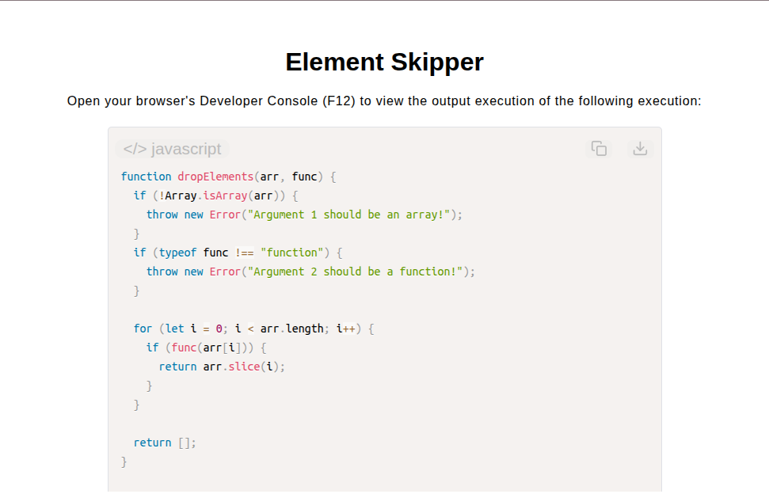

# Element Skipper

[Live Demo](https://tefol-hub.github.io/freeCodeCamp-Projects-and-Certs/Javascript-Certification/element-skipper/)
[Lab Instructions](https://www.freecodecamp.org/learn/javascript-v9/lab-element-skipper/implement-an-element-skipper)

## 📸 Preview

## 🎯 Project Goals
* **Objective:** Parse an array sequentially and discard leading elements until a provided predicate callback function evaluates to `true`.
* **Short-Circuit Evaluation:** Iterated through collection indices and immediately triggered an array slice upon locating the first element satisfying predicate conditions.
* **Non-Mutating Array Extraction:** Preserved input state integrity by utilizing `Array.prototype.slice()` to extract remaining elements rather than mutating via `.shift()`.
* **Fallback Empty Handling:** Handled edge cases where no elements passed the test function by returning a fallback empty array (`[]`).

## 🛠️ Technologies Used
* **JavaScript (ES6):** Higher-order predicate functions, `Array.prototype.slice()`, input verification checks.
* **HTML5 & CSS3:** Presentational user display framework.
* **Prism.js:** Automated syntax parsing and client-side code rendering.

## 🚀 How to Run
1. Navigate to: `cd Javascript-Certification/element-skipper`
2. Open `index.html` in your browser.
3. Access your **Developer Console (F12)** to test custom arrays with predicate filter functions.
