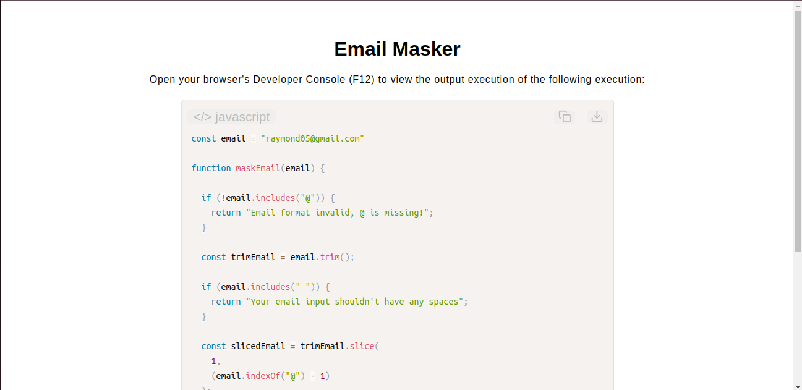

# Email Masker

[Live Demo](https://tefol-hub.github.io/freeCodeCamp-Projects-and-Certs/Javascript-Certification/email-masker/)
[Lab Instructions](https://www.freecodecamp.org/learn/javascript-v9/lab-email-masker/build-an-email-masker)

## 📸 Preview

## 🎯 Project Goals
* **Objective:** Design a string privacy masking utility function that replaces sensitive email usernames with structural asterisks while preserving domain visibility.
* **String Parsing Utilities:** Combined positional index tracking (`.indexOf()`) and string segment cropping (`.slice()`) to dynamically target inner username characters regardless of length variation.
* **Defensive Error Sanitization:** Integrated string validation guard clauses to identify bad formats, blocking missing `@` symbols or illegal inner space patterns.
* **Dynamic Generation:** Leveraged `.repeat()` inline with the calculated target index lengths to precisely match masking density to variable input parameters.

## 🛠️ Technologies Used
* **JavaScript (ES6):** String methods (`.slice()`, `.replace()`, `.repeat()`, `.indexOf()`, `.trim()`, `.includes()`) and conditional logic validation blocks.
* **HTML5 & CSS3:** Presentational markup layout dashboard.
* **Prism.js:** On-the-fly client side code visualization structure styling.

## 🚀 How to Run
1. Navigate to: `cd JavaScript-Certification/email-masker`
2. Open `index.html` in your browser.
3. Access your **Developer Console (F12)** to test input modifications and check the masked privacy string layouts.

## 📖 Possible Improvements

* I found out that it probably would've been a little more efficient to utilize .split() method to avoid some unexpected string matching behaviors. 
