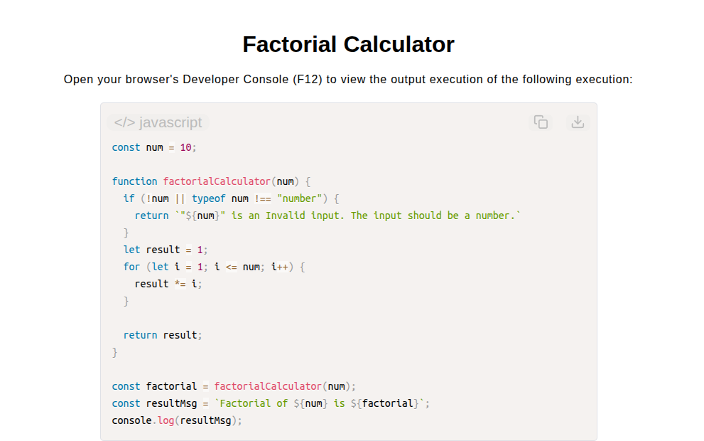

# Factorial Calculator

[Live Demo](https://tefol-hub.github.io/freeCodeCamp-Projects-and-Certs/Javascript-Certification/factorial-calculator/)
[Lab Instructions](https://www.freecodecamp.org/learn/javascript-v9/lab-factorial-calculator/build-a-factorial-calculator)

## 📸 Preview

## 🎯 Project Goals
* **Objective:** Compute the factorial product ($n!$) of a target integer using iterative loop multiplication state updates.
* **Iterative Accumulation:** Managed a multiplication product accumulator (`result *= i`) updated continuously across incremental loop steps ($1 \to n$).
* **String Interpolation & State Logging:** Synthesized calculated outputs with input variable properties using template literals into explicit status messages.
* **Input Validation:** Guarded against non-numeric or falsy parameters prior to mathematical execution.

## 🛠️ Technologies Used
* **JavaScript (ES6):** Numeric loops (`for`), multiplication assignment operators (`*=`), input type verification, and template literals.
* **HTML5 & CSS3:** Presentational user interface layout.
* **Prism.js:** Client-side source code parsing and syntax rendering.

## 🚀 How to Run
1. Navigate to: `cd Javascript-Certification/factorial-calculator`
2. Open `index.html` in your browser.
3. Access your **Developer Console (F12)** to test custom target integers between 1 and 20.
