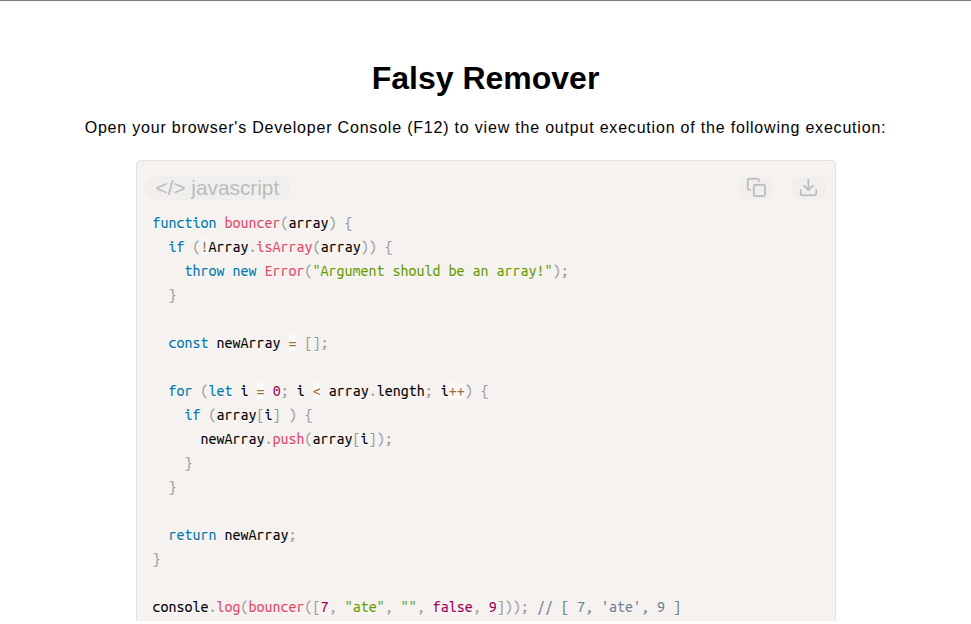

# Falsy Remover

[Live Demo](https://tefol-hub.github.io/freeCodeCamp-Projects-and-Certs/Javascript-Certification/falsy-remover/)
[Lab Instructions](https://www.freecodecamp.org/learn/javascript-v9/lab-falsy-remover/implement-a-falsy-remover)

## 📸 Preview

## 🎯 Project Goals
* **Objective:** Filter an input array to purge all primitive falsy values while preserving original element order and non-mutability guarantees.
* **Falsy Coercion Evaluation:** Leveraged implicit boolean type coercion to evaluate values against JS primitive falsy standards (`false`, `null`, `0`, `""`, `undefined`, `NaN`).
* **Pure Array Filtering:** Returned a newly constructed result array (`newArray`), ensuring the source input array remains unmodified.
* **Defensive Parameter Validation:** Verified array type structure using `Array.isArray()` guard clauses prior to loop execution.

## 🛠️ Technologies Used
* **JavaScript (ES6):** Boolean type coercion, array initialization (`[]`), element pushing (`.push()`), type guarding (`Array.isArray()`).
* **HTML5 & CSS3:** Presentational user display framework.
* **Prism.js:** Automated syntax parsing and client-side code rendering.

## 🚀 How to Run
1. Navigate to: `cd Javascript-Certification/falsy-remover`
2. Open `index.html` in your browser.
3. Access your **Developer Console (F12)** to test custom arrays containing mixed falsy types.
