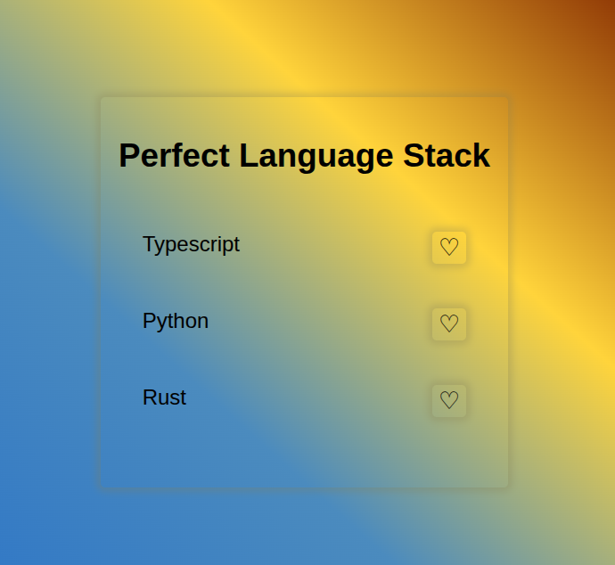

# Favorite Icon Toggler

[Live Demo](https://tefol-hub.github.io/freeCodeCamp-Projects-and-Certs/Javascript-Certification/favorite-icon-toggler/)
[Lab Instructions](https://www.freecodecamp.org/learn/javascript-v9/lab-favorite-icon-toggler/build-a-favorite-icon-toggler)

## 📸 Preview

## 🎯 Project Goals
* **Objective:** Implement a interactive list interface that toggles favorite states (empty heart `♡` vs. filled heart `❤`) upon clicking item buttons.
* **DOM Node Selection:** Selected multiple interactive DOM targets using `document.querySelectorAll("button")`.
* **Event Listener Binding:** Iterated over target node collections with `.forEach()` to attach `click` event listeners.
* **Class & Content Toggling:** Toggled element active states dynamically using `Element.classList.toggle("filled")` and updated HTML entity content (`innerHTML`) based on state evaluation.

## 🛠️ Technologies Used
* **JavaScript (ES6):** DOM Manipulation (`querySelectorAll`, `classList.toggle`, `innerHTML`), event listeners (`addEventListener`), arrow functions.
* **HTML5:** Semantic structural layout (`<main>`, `<ul>`, `<li>`, `<button>`), HTML symbol entities (`&#9825;`, `&#10084;`).
* **CSS3:** Custom variables (`:root`), gradient backgrounds, Flexbox layout, media queries.

## 🚀 How to Run
1. Navigate to: `cd Javascript-Certification/favorite-icon-toggler`
2. Open `index.html` in your browser.
3. Click any heart icon to toggle its active visual and state properties.
