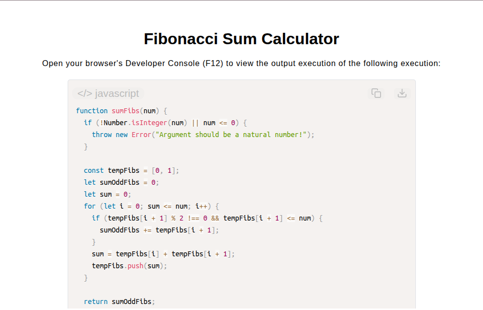

# Odd Fibonacci Sum Calculator

[Live Demo](https://tefol-hub.github.io/freeCodeCamp-Projects-and-Certs/Javascript-Certification/odd-fibonacci-sum-calculator/)
[Lab Instructions](https://www.freecodecamp.org/learn/javascript-v9/lab-odd-fibonacci-sum-calculator/build-an-odd-fibonacci-sum-calculator)

## 📸 Preview

## 🎯 Project Goals
* **Objective:** Generate terms of the Fibonacci sequence up to a given maximum boundary integer and accumulate the sum of all odd-valued terms.
* **Sequence Generation:** Evaluated terms dynamically by calculating the sum of the preceding two elements in the sequence.
* **Conditional Filtering:** Filtered values using the modulo operator (`% 2 !== 0`) to only accumulate odd Fibonacci numbers.
* **Boundary Evaluation:** Ensured term addition stopped dynamically when generated values exceeded the target maximum integer parameter (`<= num`).

## 🛠️ Technologies Used
* **JavaScript (ES6):** Dynamic array mutation, `for` loops, mathematical modulo operator, parameter range validation.
* **HTML5 & CSS3:** Presentational user display framework.
* **Prism.js:** Automated syntax parsing and client-side code rendering.

## 🚀 How to Run
1. Navigate to: `cd Javascript-Certification/odd-fibonacci-sum-calculator`
2. Open `index.html` in your browser.
3. Access your **Developer Console (F12)** to test custom integer limit inputs.

## Refactored Version
After a bit of reviewing and suggestions (*Not code solutions) from AI, I came to realize that this solution comes with a few drawbacks namely O(log n) space. The following version is improved to be O(1):

function sumFibs(num) {
  if (!Number.isInteger(num) || num <= 0) {
    throw new Error("Argument should be a natural number!");
  }

  let currentFib = 0;
  let nextFib = 1;
  let sumOddFibs = 0;
  
  for (let i = 0; nextFib <= num; i++) {
    if (nextFib % 2 !== 0 && nextFib <= num) {
      sumOddFibs += nextFib;
    }

    [currentFib, nextFib] = [nextFib, currentFib + nextFib];
  }

  return sumOddFibs;
}

console.log(sumFibs(4000000)); // 4613732
console.log(sumFibs(1)); // 2
console.log(sumFibs(4)); // 5
console.log(sumFibs(72025)); // 60696
