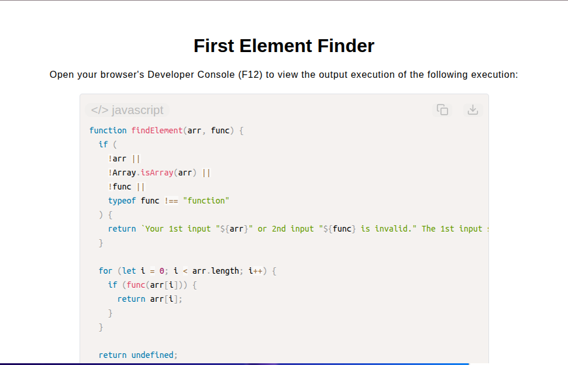

# First Element Finder

[Live Demo](https://tefol-hub.github.io/freeCodeCamp-Projects-and-Certs/Javascript-Certification/first-element-finder/)
[Lab Instructions](https://www.freecodecamp.org/learn/javascript-v9/lab-largest-number-finder/build-the-largest-number-finder)

## 📸 Preview

## 🎯 Project Goals
* **Objective:** Iterate through an array of elements and return the first element that satisfies a high-order predicate function ("truth test").
* **Higher-Order Functions:** Accepted and executed callback predicate functions dynamically inside the loop lifecycle.
* **Early Return Short-Circuiting:** Terminated iteration immediately upon matching a truthy predicate condition, returning `undefined` if no elements pass.
* **Defensive Guarding:** Enforced structure and callback validation (`Array.isArray()`, `typeof func === "function"`).

## 🛠️ Technologies Used
* **JavaScript (ES6):** Higher-order function callbacks, predicate execution, short-circuit returns, array iteration.
* **HTML5 & CSS3:** Presentational user display framework.
* **Prism.js:** Automated syntax parsing and client-side code rendering.

## 🚀 How to Run
1. Navigate to: `cd Javascript-Certification/first-element-finder`
2. Open `index.html` in your browser.
3. Access your **Developer Console (F12)** to test custom elements and predicate callbacks.
