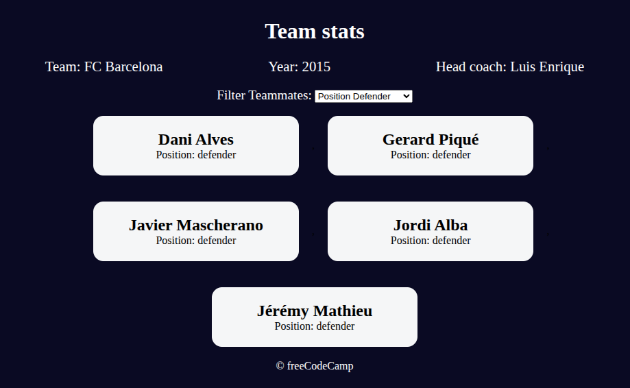

# Football Team Cards

[Live Demo](https://tefol-hub.github.io/freeCodeCamp-Projects-and-Certs/Javascript-Certification/football-team-cards/)
[Lab Instructions](https://www.freecodecamp.org/learn/javascript-v9/lab-football-team-cards/lab-football-team-cards)

## 📸 Preview

## 🎯 Project Goals
* **Objective:** Build an interactive player roster UI that displays team information and dynamically filters player cards based on selected positions using JavaScript object arrays.
* **Data Structuring:** Modeled team information using a nested JavaScript object featuring metadata properties (`team`, `year`, `headCoach`) and an array of `players` objects (`name`, `position`, `isCaptain`).
* **Dynamic Array Filtering & Rendering:** Utilized `.filter()`, `.map()`, and `.join("")` array operations to filter data by position criteria and transform records into HTML templates.
* **Form Event Handling:** Listened to dropdown select modifications via `change` event listeners to dynamically update container `.innerHTML` without triggering page refreshes.

## 🛠️ Technologies Used
* **JavaScript (ES6):** Objects, object arrays, array iteration (`filter`, `map`, `join`), DOM selection (`getElementById`), `change` event listeners, template literals, conditional ternary operators.
* **HTML5:** Semantic components (`<main>`, `<select>`, `<option>`, `<footer>`), form labeling (`<label>`).
* **CSS3:** Flexbox layout styling, custom CSS variables (`:root`), media queries for mobile responsiveness, card component styling.

## 🚀 How to Run
1. Navigate to: `cd Javascript-Certification/football-team-cards`
2. Open `index.html` in your browser.
3. Select any player position from the dropdown to instantly filter the player cards displayed.