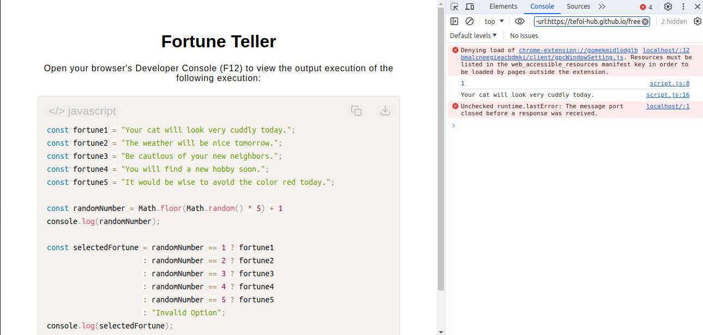

# Fortune Teller

[Live Demo](https://tefol-hub.github.io/freeCodeCamp-Projects-and-Certs/Javascript-Certification/fortune-teller/)
[Lab Instructions](https://www.freecodecamp.org/learn/javascript-v9/lab-fortune-teller/build-a-fortune-teller)

## 📸 Preview

## 🎯 Project Goals
* **Objective:** Implement pseudo-random numbers and conditional control flows to create an automated prediction generator.
* **Randomization Engineering:** Combined `Math.random()` with `Math.floor()` to dynamically generate clamped, predictable integer values.
* **Advanced Conditional Architecture:** Applied chained, nested ternary operators (`? :`) to selectively execute programmatic string responses based on numerical variable state matches.

## 🛠️ Technologies Used
* **JavaScript (ES6):** Math objects (`.random()`, `.floor()`), ternary expressions, and conditional workflows.
* **HTML5 & CSS3:** Presentational user interface layout.
* **Prism.js:** Source code parsing and UI highlighting integration.

## 🚀 How to Run
1. Navigate to: `cd JavaScript-Certification/fortune-teller`
2. Open `index.html` in your browser.
3. Access the **Developer Console (F12)** and refresh the page to view a new random fortune assignment upon each execution.
