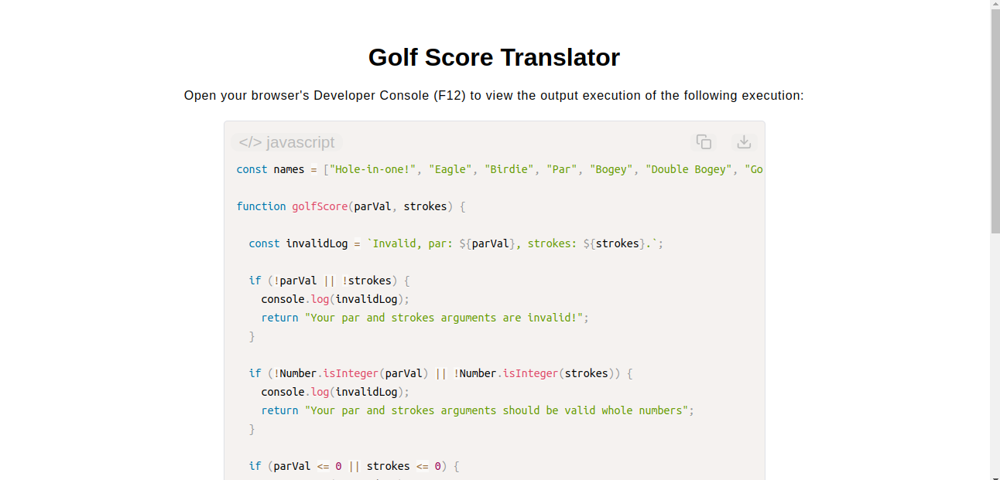

# Golf Score Translator

[Live Demo](https://tefol-hub.github.io/freeCodeCamp-Projects-and-Certs/Javascript-Certification/golf-score-translator/)
[Lab Instructions](https://www.freecodecamp.org/learn/javascript-v9/lab-golf-score-translator/build-a-golf-score-translator)

## 📸 Preview

## 🎯 Project Goals
* **Objective:** Create a game-logic translation system that maps calculated relationships between course pars and players' strokes to traditional scoring nicknames.
* **Array Destructuring:** Used modern ES6 array destructuring assignment to unpack reference elements directly from an array variable blueprint into independent conditional handles.
* **Chained Conditional Mapping:** Assembled a precise top-down sequential ternary engine evaluating relative value differentials cleanly without bloated if/else nested nesting statements.
* **Strict Numerical Sandboxing:** Deployed deep sanity guards rejecting zero records, decimal floats, missing properties, or negative parameters (`parVal <= 0 || strokes <= 0`) prior to logic processing.

## 🛠️ Technologies Used
* **JavaScript (ES6):** Array destructuring, integer parsing checks (`Number.isInteger()`), strict equality operators, and inline string interpolation.
* **HTML5 & CSS3:** Presentational user display framework.
* **Prism.js:** Asynchronous code markup syntax styling library.

## 🚀 How to Run
1. Navigate to: `cd Javascript-Certification/golf-score-translator`
2. Open `index.html` in your browser.
3. Pull up your browser's **Developer Console (F12)** to test various par-to-stroke variations and verify name translations.
