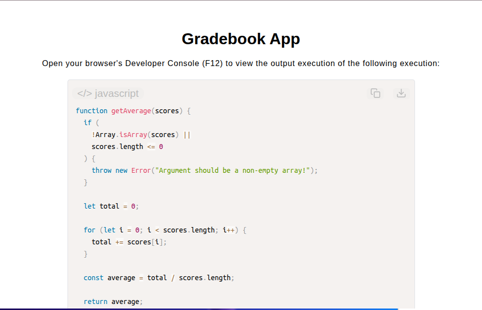

# Gradebook App

[Live Demo](https://tefol-hub.github.io/freeCodeCamp-Projects-and-Certs/Javascript-Certification/gradebook-app/)
[Lab Instructions](https://www.freecodecamp.org/learn/javascript-v9/lab-gradebook-app/build-a-gradebook-app)

## 📸 Preview

## 🎯 Project Goals
* **Objective:** Calculate class performance averages, map numerical scores to letter grade brackets, evaluate passing thresholds, and assemble student status communications.
* **Modular Function Chaining:** Composition of decoupled micro-utilities (`getAverage`, `getGrade`, `hasPassingGrade`) inside the primary `studentMsg` reporter.
* **Ternary Decision Chains:** Mapped score boundaries to grade representations using clean, chained ternary conditional expressions.
* **Template Literal Interpolation:** Formatted personalized performance status strings using interpolated ES6 template syntax.

## 🛠️ Technologies Used
* **JavaScript (ES6):** Function composition, chained ternary operators, template literal interpolation, array accumulation loops, arithmetic operations.
* **HTML5 & CSS3:** Presentational user display framework.
* **Prism.js:** Automated syntax parsing and client-side code rendering.

## 🚀 How to Run
1. Navigate to: `cd Javascript-Certification/gradebook-app`
2. Open `index.html` in your browser.
3. Access your **Developer Console (F12)** to test custom class score distributions and student grade evaluations.

## Possible Improvements
Allow for the possibility of decimal scores.
Use the following validation method instead:
// Allows valid decimal score floats like 88.5
if (typeof score !== "number" || Number.isNaN(score) || score < 0 || score > 100) {
  throw new Error("Argument must be a valid number between 0 and 100!");
}
