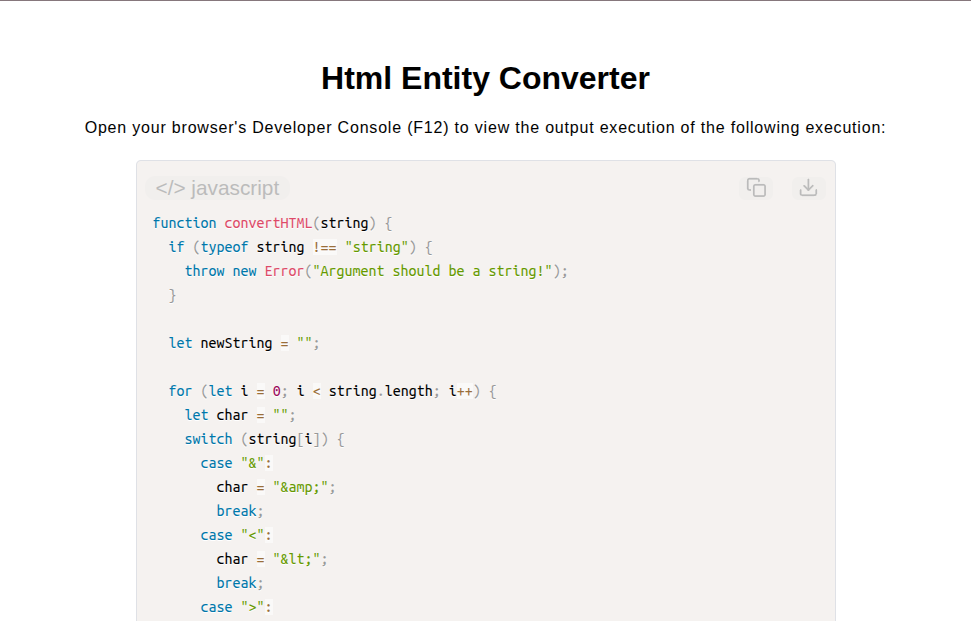

# HTML Entity Converter

[Live Demo](https://tefol-hub.github.io/freeCodeCamp-Projects-and-Certs/Javascript-Certification/html-entity-converter/)
[Lab Instructions](https://www.freecodecamp.org/learn/javascript-v9/lab-html-entitiy-converter/implement-an-html-entity-converter)

## 📸 Preview

## 🎯 Project Goals
* **Objective:** Parse string inputs and escape special HTML markup characters into their secure entity reference equivalents.
* **Special Character Sanitization:** Mapped HTML reserve characters (`&`, `<`, `>`, `"`, `'`) directly to safe entity strings (`&amp;`, `&lt;`, `&gt;`, `&quot;`, `&apos;`).
* **Character-by-Character Parsing:** Iterated through input text strings using `switch` conditional branching to preserve standard characters while transforming target symbols.
* **Defensive Type Checking:** Enforced strict parameter string verification prior to string compilation loops.

## 🛠️ Technologies Used
* **JavaScript (ES6):** String traversal, `switch/case` control structures, string concatenation, error throwing.
* **HTML5 & CSS3:** Presentational user display framework.
* **Prism.js:** Automated syntax parsing and client-side code rendering.

## 🚀 How to Run
1. Navigate to: `cd Javascript-Certification/html-entity-converter`
2. Open `index.html` in your browser.
3. Access your **Developer Console (F12)** to test custom text string conversions.
