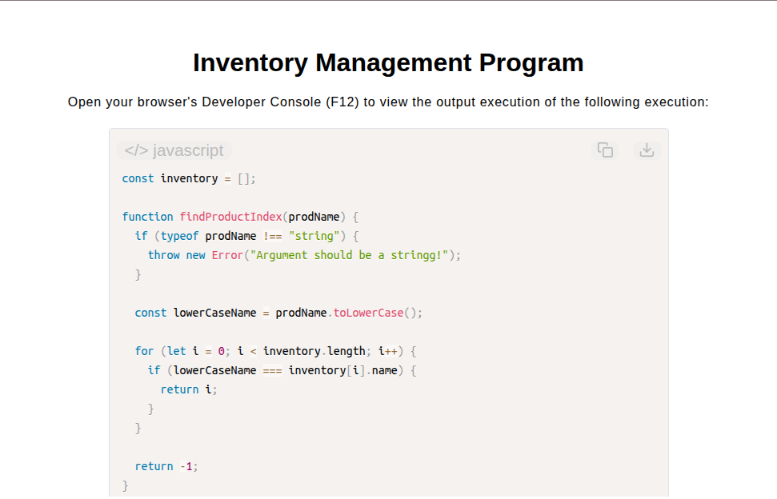

# Inventory Management Program

[Live Demo](https://tefol-hub.github.io/freeCodeCamp-Projects-and-Certs/Javascript-Certification/inventory-management-program/)
[Lab Instructions](https://www.freecodecamp.org/learn/javascript-v9/lab-inventory-management-program/build-an-inventory-management-program)

## 📸 Preview

## 🎯 Project Goals
* **Objective:** Maintain a dynamic inventory state array by performing lookup, insertion, accumulation, and conditional removal operations.
* **Case-Insensitive Normalization:** Standardized string queries using `.toLowerCase()` to ensure unified inventory keys across all search and modification functions.
* **State Mutation & Lookup:** Located existing items via index searches (`findProductIndex`) to apply quantity accumulation or item removal (`.splice()`).
* **Conditional Boundary Checks:** Evaluated stock thresholds to handle insufficient quantity warnings, exact zero-stock purge conditions, and missing product lookup handling.

## 🛠️ Technologies Used
* **JavaScript (ES6):** Array mutation (`.push()`, `.splice()`), object property manipulation, template literals, conditional statements, string case conversion.
* **HTML5 & CSS3:** Presentational user display framework.
* **Prism.js:** Automated syntax parsing and client-side code rendering.

## 🚀 How to Run
1. Navigate to: `cd Javascript-Certification/inventory-management-program`
2. Open `index.html` in your browser.
3. Access your **Developer Console (F12)** to test item addition, removal, and quantity updates in `inventory`.
