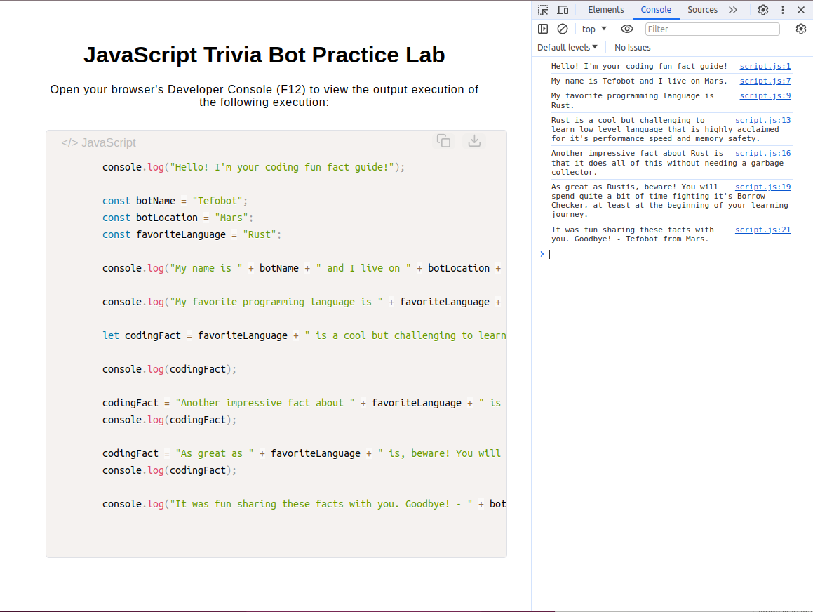

# JavaScript Trivia Bot

[Live Demo](https://tefol-hub.github.io/freeCodeCamp-Projects-and-Certs/JavaScript-Certification/javascript-trivia-bot/)
[Lab Instructions](https://www.freecodecamp.org/learn/javascript-v9/lab-javascript-trivia-bot/lab-javascript-trivia-bot)

## 📸 Preview

## 🎯 Project Goals
* **Objective:** Learn basic JavaScript data tracking and string manipulation.
* **Variables & Constants:** Worked with `const` for immutable values (bot profiles) and `let` for reassignable data.
* **String Concatenation:** Merged dynamic variables into static string templates using the `+` operator.
* **Custom Enhancement:** Built an HTML/CSS wrapper featuring the Prism.js library to display the execution code natively in the browser alongside a custom SVG download button.

## 🛠️ Technologies Used
* **JavaScript (ES6):** Variables, basic data types, and string concatenation.
* **HTML5 & CSS3:** Structured layout and code block rendering.
* **Prism.js:** Code syntax highlighting and DOM token styling.

## 🚀 How to Run
1. Navigate to: `cd JavaScript-Certification/javascript-trivia-bot`
2. Open `index.html` in your browser.
3. Open your browser's **Developer Console (F12)** to view the live JavaScript execution logs.