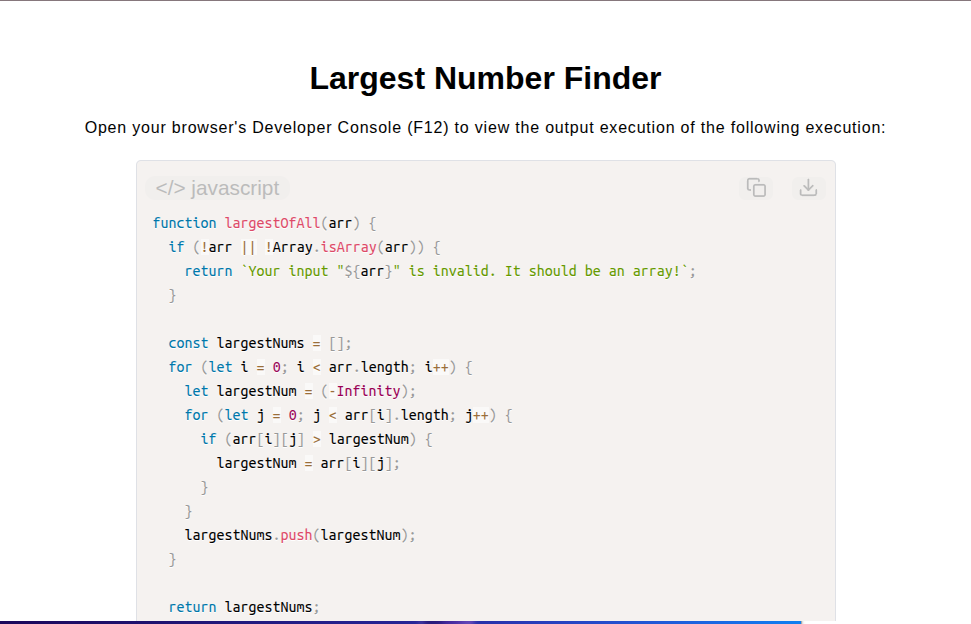

# Largest Number Finder

[Live Demo](https://tefol-hub.github.io/freeCodeCamp-Projects-and-Certs/Javascript-Certification/largest-number-finder/)
[Lab Instructions](https://www.freecodecamp.org/learn/javascript-v9/lab-largest-number-finder/build-the-largest-number-finder)

## 📸 Preview

## 🎯 Project Goals
* **Objective:** Extract the maximum numerical value from each nested sub-array in a two-dimensional matrix.
* **Negative Number Initialization:** Bound initial comparison state to `-Infinity` to correctly evaluate sub-arrays containing exclusively negative values.
* **Nested Matrix Traversal:** Used nested `for` loops to iterate through rows and columns of multidimensional arrays.
* **Type Guarding:** Enforced structure verification (`Array.isArray()`) to ensure valid collection inputs.

## 🛠️ Technologies Used
* **JavaScript (ES6):** Multi-dimensional array iteration, comparison logic, array methods (`.push()`), and special numeric constants (`-Infinity`).
* **HTML5 & CSS3:** Presentational user display framework.
* **Prism.js:** Automated syntax parsing and client-side code rendering.

## 🚀 How to Run
1. Navigate to: `cd Javascript-Certification/largest-number-finder`
2. Open `index.html` in your browser.
3. Access your **Developer Console (F12)** to test custom 2D matrix arrays.

## Possible improvements 
As per the suggestion of ai (chatgpt) I could use the following solution next time:
function largestOfAll(arr) {
  return arr.map(subArr => Math.max(...subArr));
}
