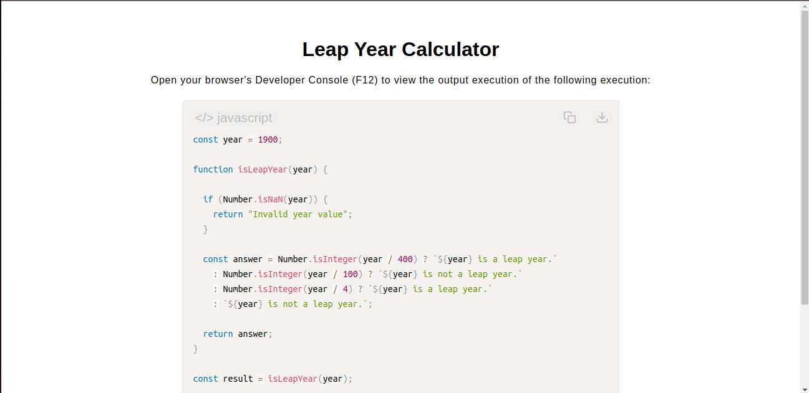

# Leap Year Calculator

[Live Demo](https://tefol-hub.github.io/freeCodeCamp-Projects-and-Certs/Javascript-Certification/leap-year-calculator/)
[Lab Instructions](https://www.freecodecamp.org/learn/javascript-v9/lab-leap-year-calculator/build-a-leap-year-calculator)

## 📸 Preview

## 🎯 Project Goals
* **Objective:** Create an algorithmic system to evaluate calendar years and determine leap year eligibility based on historical astronomical constraints.
* **Cascading Conditional Logic:** Designed a top-down nested ternary evaluation path that catches overriding conditions (divisibility by 400) before processing secondary rules (100 and 4).
* **Defensive Float/Type Isolation:** Implemented `Number.isNaN()` type-checking boundaries to eliminate corrupt input values prior to arithmetic processing.

## 🛠️ Technologies Used
* **JavaScript (ES6):** Integer check methods (`Number.isInteger()`), short-circuit evaluations, and template literals.
* **HTML5 & CSS3:** Presentational user interface layout.
* **Prism.js:** Automated client-side token styling and script visualization.

## 🚀 How to Run
1. Navigate to: `cd Javascript-Certification/leap-year-calculator`
2. Open `index.html` in your browser.
3. Use the **Developer Console (F12)** to invoke the function with custom milestone years (e.g., 2000, 1900, 2024) to track output logic accuracy.

## Possible Improvements
* It is probably better to use year % num === 0 as the more standard convention to check for even numbers. 
