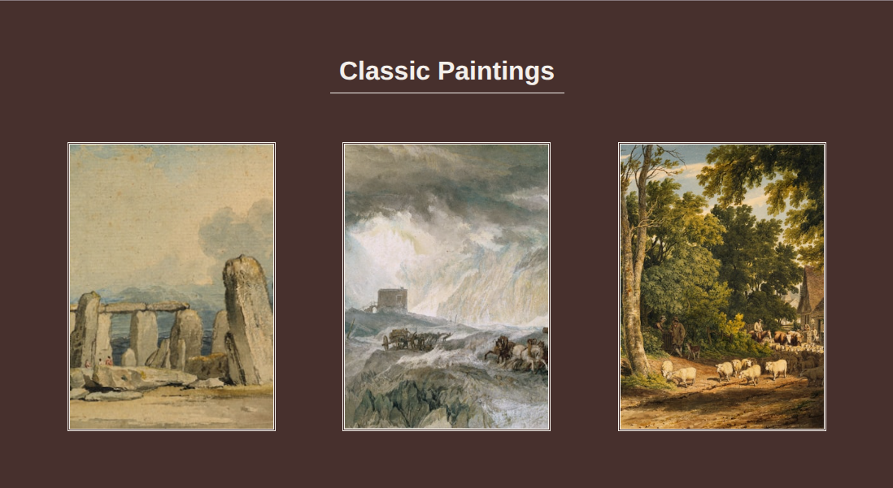

# Lightbox Viewer

[Live Demo](https://tefol-hub.github.io/freeCodeCamp-Projects-and-Certs/Javascript-Certification/lightbox-viewer/)
[Lab Instructions](https://www.freecodecamp.org/learn/javascript-v9/lab-lightbox-viewer/build-a-lightbox-viewer)

## 📸 Preview

## 🎯 Project Goals
* **Objective:** Construct a full-screen image modal overlay (lightbox) that displays full-sized imagery when gallery thumbnail elements are clicked.
* **String URL Transformation:** Dynamically derived high-resolution image URLs by replacing the `-thumbnail` string segment from clicked element `.src` attributes.
* **Modal Viewport Styling:** Structured fixed position overlay elements spanning `100%` viewport width and height with CSS Flexbox layouts.
* **Event-Driven Visibility:** Toggled element layout states (`display: flex` vs. `display: none`) across thumbnail, close button, and backdrop overlay interactions.

## 🛠️ Technologies Used
* **JavaScript (ES6):** DOM selection (`querySelectorAll`, `querySelector`), `addEventListener`, string manipulation (`.replace()`), style manipulation.
* **HTML5:** Semantic markup (`<main>`, `
`, `<button>`), HTML symbol entities (`&times;`).
* **CSS3:** Fixed positioning, viewport sizing units (`vw`/`vh`), CSS Grid layout, Flexbox centering, opacity overlays.

## 🚀 How to Run
1. Navigate to: `cd Javascript-Certification/lightbox-viewer`
2. Open `index.html` in your browser.
3. Click any thumbnail image to trigger the lightbox modal preview, then click the close button or background overlay to exit.
