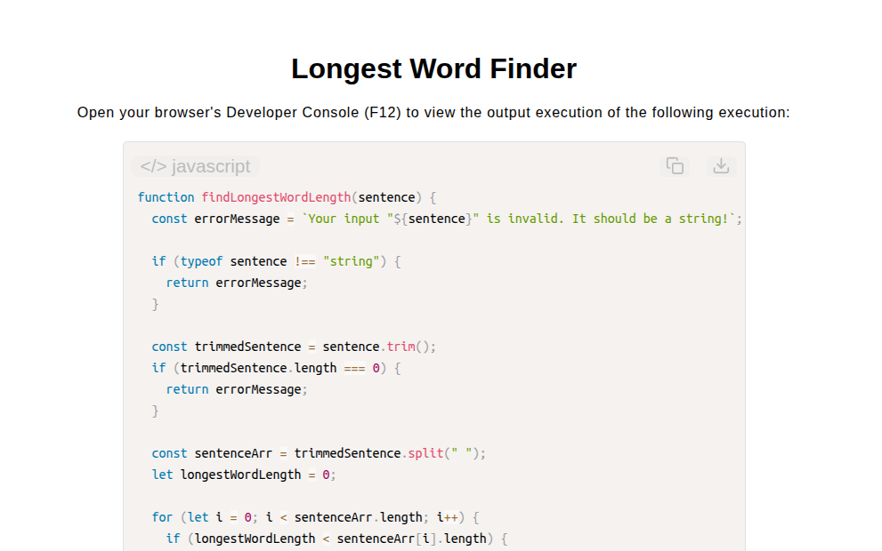

# Longest Word Finder

[Live Demo](https://tefol-hub.github.io/freeCodeCamp-Projects-and-Certs/Javascript-Certification/longest-word-finder/)
[Lab Instructions](https://www.freecodecamp.org/learn/javascript-v9/lab-longest-word-in-a-string/build-a-longest-word-finder-app)

## 📸 Preview

## 🎯 Project Goals
* **Objective:** Parse natural language sentences to compute and return the character length of the single longest word present in the text.
* **String Tokenization:** Converted raw text streams into discrete word elements using whitespace delimiter splitting (`.split(" ")`).
* **Iterative Maximum Tracking:** Executed index-based `for` loop passes over the token array, continuously reassigning a tracking accumulator (`longestWordLength`) whenever a larger element was evaluated.
* **Input Defensive Checks:** Guarded against non-string arguments and empty or space-only inputs using `.trim()` and `typeof` validations.

## 🛠️ Technologies Used
* **JavaScript (ES6):** Array iteration (`for` loops), string tokenization (`.split()`, `.trim()`), dynamic type checking, and conditional evaluation.
* **HTML5 & CSS3:** Presentational user interface layout.
* **Prism.js:** Automated client-side token parsing and source display.

## 🚀 How to Run
1. Navigate to: `cd Javascript-Certification/longest-word-finder`
2. Open `index.html` in your browser.
3. Open your browser's **Developer Console (F12)** to test custom sentence inputs with varying word lengths.
