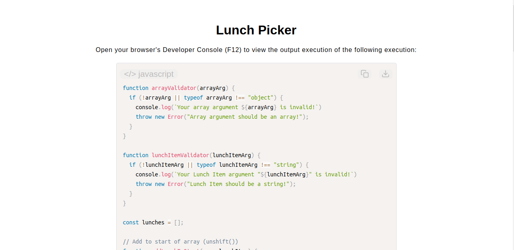

# Lunch Picker Program

[Live Demo](https://tefol-hub.github.io/freeCodeCamp-Projects-and-Certs/Javascript-Certification/lunch-picker/)
[Lab Instructions](https://www.freecodecamp.org/learn/javascript-v9/lab-lunch-picker-program/build-a-lunch-picker-program)

## 📸 Preview

## 🎯 Project Goals
* **Objective:** Design a menu-management suite using essential array manipulation methods to dynamically append, prepend, extract, and select records.
* **Array Mutation Mechanics:** Mastered the native index-shifting operations of `.push()`, `.pop()`, `.unshift()`, and `.shift()`.
* **Centralized Code Validation:** Extracted type-checking tasks into independent validator helper engines (`arrayValidator`, `lunchItemValidator`) to enforce parameter integrity via structural error exception throwing.
* **Array-to-String Normalization:** Utilized `.join(", ")` to seamlessly parse internal array item collections into formatted presentational strings.

## 🛠️ Technologies Used
* **JavaScript (ES6):** Array tracking systems, runtime input exceptions (`throw new Error`), validation blocks, and index-clamped mathematics.
* **HTML5 & CSS3:** Semantic presentational document framework.
* **Prism.js:** Client-side source rendering and code visual design components.

## 🚀 How to Run
1. Navigate to: `cd Javascript-Certification/lunch-picker`
2. Open `index.html` in your browser.
3. Access your **Developer Console (F12)** to review sequential stack transformations as elements are pushed, popped, and randomly parsed.
