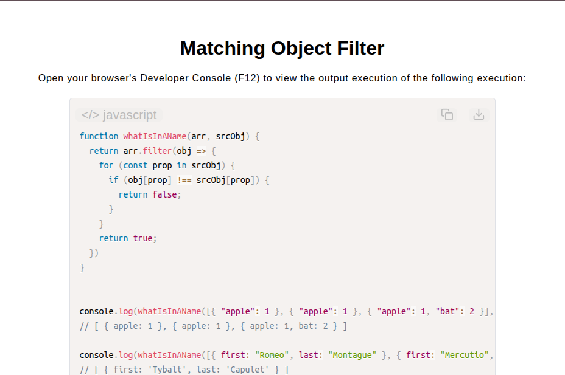

# Matching Object Filter

[Live Demo](https://tefol-hub.github.io/freeCodeCamp-Projects-and-Certs/Javascript-Certification/matching-object-filter/)
[Lab Instructions](https://www.freecodecamp.org/learn/javascript-v9/lab-matching-object-filter/implement-a-matching-object-filter)

## 📸 Preview

## 🎯 Project Goals
* **Objective:** Filter a collection array of objects to isolate entities matching all key-value pair criteria defined in a source reference object.
* **Higher-Order Array Filtering:** Utilized `Array.prototype.filter()` to evaluate each item in the collection against source constraints.
* **Property Matching & Short-Circuit Evaluation:** Iterated over target property keys in the source object and short-circuited early (`return false`) upon encountering any missing or mismatched property values.
* **Empty Fallback Handling:** Preserved safety by returning an empty collection (`[]`) when no objects matched the complete property criteria.

## 🛠️ Technologies Used
* **JavaScript (ES6):** Higher-Order Functions (`.filter()`), `for...in` property loops, bracket property accessing, boolean evaluation.
* **HTML5 & CSS3:** Presentational user display framework.
* **Prism.js:** Automated syntax parsing and client-side code rendering.

## 🚀 How to Run
1. Navigate to: `cd Javascript-Certification/matching-object-filter`
2. Open `index.html` in your browser.
3. Access your **Developer Console (F12)** to test custom object collections and source filter criteria.
