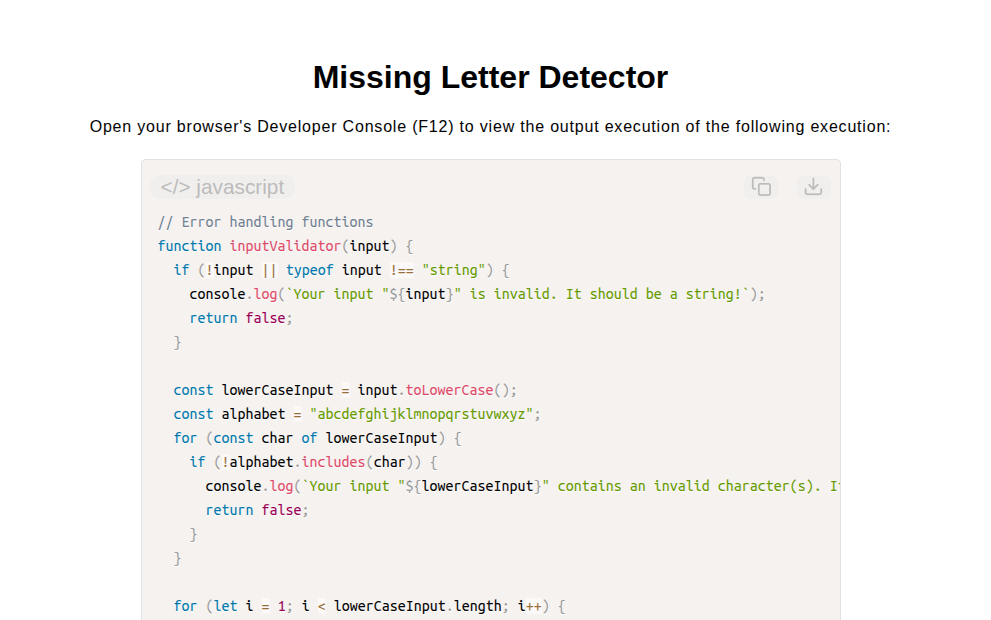

# Missing Letter Detector

[Live Demo](https://tefol-hub.github.io/freeCodeCamp-Projects-and-Certs/Javascript-Certification/missing-letter-detector/)
[Lab Instructions](https://www.freecodecamp.org/learn/javascript-v9/lab-missing-letter-detector/build-a-missing-letter-detector)

## 📸 Preview

## 🎯 Project Goals
* **Objective:** Detect and return missing alphabetical characters within an ordered letter string range, returning `undefined` when the sequence is complete.
* **Reference Range Slicing:** Derived expected sequence boundaries by mapping input terminal indices (`.indexOf()`) onto a master alphabet string to slice ideal baseline comparison arrays.
* **Gap auditing:** Evaluated reference character presence using `.includes()` inside short-circuiting loops to isolate missing sequence characters.
* **Sequence Order Validation:** Constructed multi-pass input guards confirming character alphabet membership and strictly ascending alphabetical ordering.

## 🛠️ Technologies Used
* **JavaScript (ES6):** String methods (`.indexOf()`, `.slice()`, `.includes()`), loop control flow (`for...of`), and sequence evaluation logic.
* **HTML5 & CSS3:** Presentational user display framework.
* **Prism.js:** Automated syntax parsing and client-side code rendering.

## 🚀 How to Run
1. Navigate to: `cd Javascript-Certification/missing-letter-detector`
2. Open `index.html` in your browser.
3. Access your **Developer Console (F12)** to test custom letter ranges with missing character gaps.

## Possible Improvements
Instead of validating if the input is in alphabetic order I could rather sort the input. 
Furthermore instead of comparing consecutive indices of the input I would rather compare their ASCII character codes like so:
for (let i = 0; i < str.length - 1; i++) {
  if (str.charCodeAt(i + 1) - str.charCodeAt(i) > 1) {
    return String.fromCharCode(str.charCodeAt(i) + 1);
  }
}   
