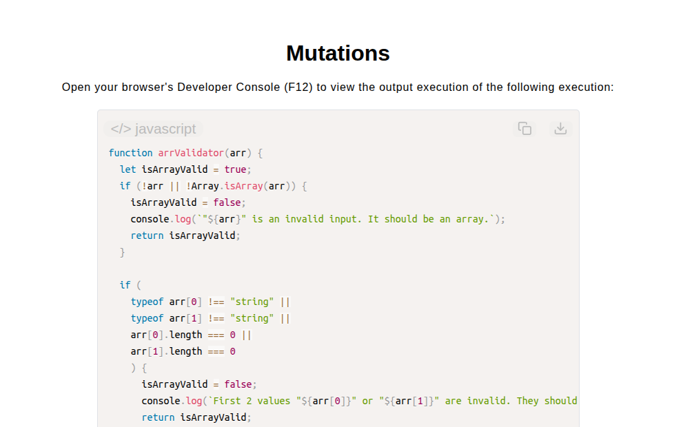

# Mutations Algorithm

[Live Demo](https://tefol-hub.github.io/freeCodeCamp-Projects-and-Certs/Javascript-Certification/mutations/)
[Lab Instructions](https://www.freecodecamp.org/learn/javascript-v9/lab-mutations/implement-the-mutations-algorithm)

## 📸 Preview

## 🎯 Project Goals
* **Objective:** Determine if all characters of a secondary string argument exist within a primary target string, ignoring case sensitivity.
* **Short-Circuit Character Auditing:** Utilized `for...of` iteration over normalized target strings to exit early (`break`) on the first missing character match.
* **Case-Insensitive Normalization:** Leveraged `.toLowerCase()` string transformation to ensure uniform character comparison across varied casing inputs.
* **Multi-Layered Validation:** Enforced defensive array structure checks, non-empty string parameter verification, and alphabet character filtering.

## 🛠️ Technologies Used
* **JavaScript (ES6):** String methods (`.toLowerCase()`, `.includes()`), `for...of` loops, array type validation (`Array.isArray`), and logical short-circuiting.
* **HTML5 & CSS3:** Presentational user interface framework.
* **Prism.js:** Client-side source code formatting and syntax highlighting.

## 🚀 How to Run
1. Navigate to: `cd Javascript-Certification/mutations`
2. Open `index.html` in your browser.
3. Open your browser's **Developer Console (F12)** to test custom string mutation pairs.
