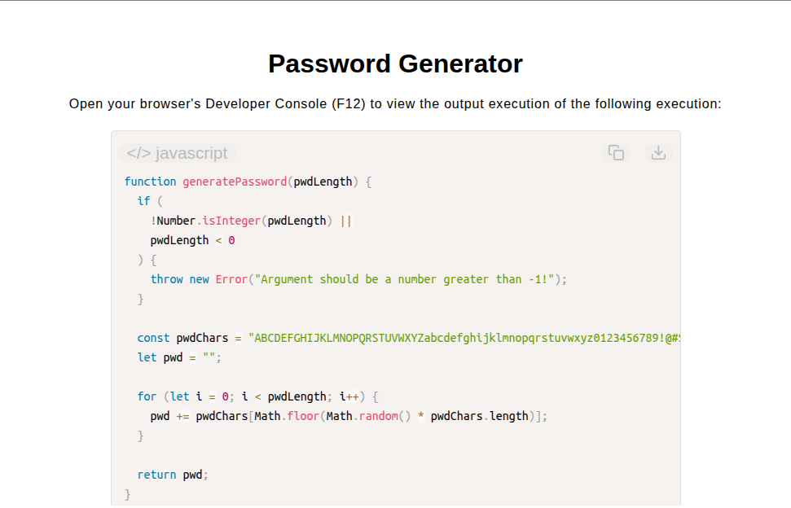

# Password Generator App

[Live Demo](https://tefol-hub.github.io/freeCodeCamp-Projects-and-Certs/Javascript-Certification/password-generator/)
[Lab Instructions](https://www.freecodecamp.org/learn/javascript-v9/lab-password-generator/lab-password-generator)

## 📸 Preview

## 🎯 Project Goals
* **Objective:** Construct a dynamic string generation utility that samples characters at random positions to build a secure password string of requested length.
* **Pseudorandom Selection:** Combined `Math.random()` scaled across character set bounds alongside `Math.floor()` indexing to select random individual characters.
* **String Assembly:** Accumulated individual character lookup results into a cohesive output string over a designated iteration loop length.
* **Input Validation:** Enforced integer length constraints via `Number.isInteger()` and non-negative range validations.

## 🛠️ Technologies Used
* **JavaScript (ES6):** `Math.random()`, `Math.floor()`, string indexing, template literals, type verification routines.
* **HTML5 & CSS3:** Presentational user display framework.
* **Prism.js:** Automated syntax parsing and client-side code rendering.

## 🚀 How to Run
1. Navigate to: `cd Javascript-Certification/password-generator`
2. Open `index.html` in your browser.
3. Access your **Developer Console (F12)** to test custom password length inputs and generation runs.
