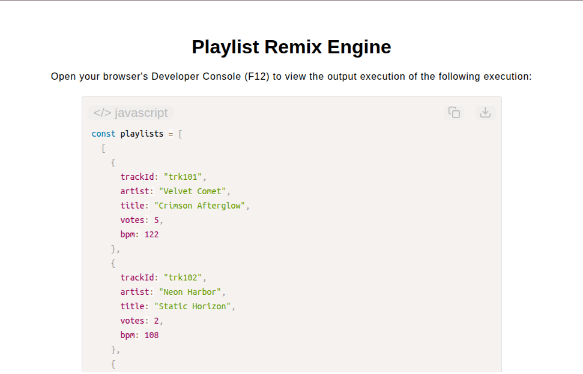

# Playlist Remix Engine

[Live Demo](https://tefol-hub.github.io/freeCodeCamp-Projects-and-Certs/Javascript-Certification/playlist-remix-engine/)
[Lab Instructions](https://www.freecodecamp.org/learn/javascript-v9/lab-playlist-remix-engine/build-a-playlist-remix-engine)

## 📸 Preview

## 🎯 Project Goals
* **Objective:** Construct a data transformation pipeline to merge, score, deduplicate, limit, and schedule multi-listener playlist submissions into a broadcast track order.
* **Flattening & Metadata Tracking:** Combined multi-dimensional arrays while tracking originating playlist and track indices in a `source` tuple (`[playlistIdx, trackIdx]`).
* **Dynamic Scoring Algorithm:** Computed song scores using targeted parameter weights (`votes * 10 - Math.abs(bpm - 120)`).
* **Deduplication & Quota Enforcement:** Purged duplicate `trackId` entries and capped artist frequency caps using state tracking structures (`Set` / dynamic frequency maps).
* **Schedule Compilation:** Mapped finalized candidate tracks to sequential 1-based index broadcast slots (`{ slot, trackId }`).

## 🛠️ Technologies Used
* **JavaScript (ES6):** Modular function composition, Object destruction, dynamic property evaluation (`Object.hasOwn()`), state tracking, pipeline chaining.
* **HTML5 & CSS3:** Presentational user display framework.
* **Prism.js:** Automated syntax parsing and client-side code rendering.

## 🚀 How to Run
1. Navigate to: `cd Javascript-Certification/playlist-remix-engine`
2. Open `index.html` in your browser.
3. Access your **Developer Console (F12)** to test custom playlist arrays and quota limits.
