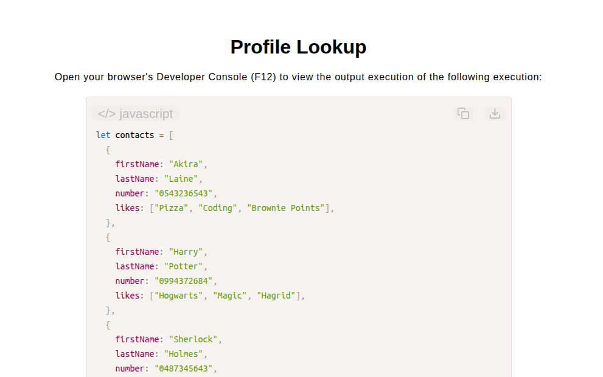

# Profile Lookup

[Live Demo](https://tefol-hub.github.io/freeCodeCamp-Projects-and-Certs/Javascript-Certification/profile-lookup/)
[Lab Instructions](https://www.freecodecamp.org/learn/javascript-v9/lab-profile-lookup/lab-profile-lookup)

## 📸 Preview

## 🎯 Project Goals
* **Objective:** Query an array of contact objects to return requested property values or report specific search anomalies ("No such contact" vs. "No such property").
* **Linear Array Searching:** Iterated over object collections using `for` loops to perform targeted identifier matching.
* **Property Existence Verification:** Utilized `Object.hasOwn()` lookups to safely inspect dynamic keys on matched nested objects.
* **Defensive Guarding:** Implemented type verification and presence checks on both `name` and `property` query arguments before execution.

## 🛠️ Technologies Used
* **JavaScript (ES6):** Collection iteration (`for` loops), property auditing (`Object.hasOwn()`), object property access, and string validation.
* **HTML5 & CSS3:** Presentational user display framework.
* **Prism.js:** Automated syntax parsing and client-side code rendering.

## 🚀 How to Run
1. Navigate to: `cd Javascript-Certification/profile-lookup`
2. Open `index.html` in your browser.
3. Open your browser's **Developer Console (F12)** to query contact names and property fields.
