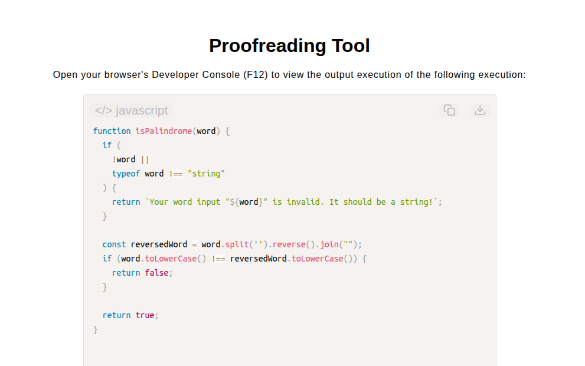

# Proofreading Tool

[Live Demo](https://tefol-hub.github.io/freeCodeCamp-Projects-and-Certs/Javascript-Certification/proofreading-tool/)
[Lab Instructions](https://www.freecodecamp.org/learn/javascript-v9/lab-proofreading-tool/build-a-proofreading-tool)

## 📸 Preview

## 🎯 Project Goals
* **Objective:** Analyze multi-document collections of word tokens to detect non-palindromic target words and index overlapping multi-word repeated phrases ($n$-grams).
* **Sliding Window N-Gram Extraction:** Extracted multi-word sequences using windowed sub-array slicing (`.slice(i, i + phraseLength).join(" ")`) to evaluate phrase patterns across overlapping token offsets.
* **Nested Sequence Search:** Used bounded nested loops (`outerLoop` / `innerLoop`) to track and deduplicate initial and duplicate phrase occurrence start indices.
* **String Reversal Palindrome Check:** Reversed character arrays (`.split("").reverse().join("")`) with case normalization to isolate non-palindromic sequence breaks.
* **Batch Text Analytics Engine:** Aggregated phrase repetition index lists and palindrome break metrics into structured document analysis report objects.

## 🛠️ Technologies Used
* **JavaScript (ES6):** Sliding window pattern search, array tokenization (`.slice()`, `.join()`), string manipulation (`.split()`, `.reverse()`), nested loops, and structural aggregation.
* **HTML5 & CSS3:** Presentational user display framework.
* **Prism.js:** Automated syntax parsing and client-side code rendering.

## 🚀 How to Run
1. Navigate to: `cd Javascript-Certification/proofreading-tool`
2. Open `index.html` in your browser.
3. Access your **Developer Console (F12)** to test custom text arrays with varying phrase lengths.
