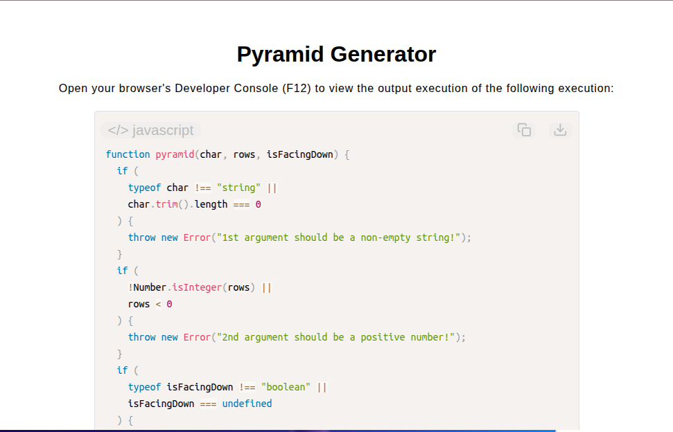

# Pyramid Generator

[Live Demo](https://tefol-hub.github.io/freeCodeCamp-Projects-and-Certs/Javascript-Certification/pyramid-generator/)
[Lab Instructions](https://www.freecodecamp.org/learn/javascript-v9/lab-pyramid-generator/lab-pyramid-generator)

## 📸 Preview

## 🎯 Project Goals
* **Objective:** Construct a dynamically formatted, multi-line ASCII pyramid string based on configurable pattern characters, row counts, and vertical orientations.
* **Mathematical Row Sizing:** Formulated odd-length character sequences using $1 + 2i$ character scaling per row $i$.
* **Symmetrical Space Padding:** Computed leading space offsets (`" ".repeat(spaces)`) to align central pattern axes across inverted and standard row sequences.
* **Bidirectional Loop Execution:** Handled standard (upward) and inverted (downward) orientations via incrementing and decrementing iteration routines.

## 🛠️ Technologies Used
* **JavaScript (ES6):** String methods (`.repeat()`, `.trim()`), arithmetic iteration, conditional control flow, strict type assertions.
* **HTML5 & CSS3:** Presentational user display framework.
* **Prism.js:** Automated syntax parsing and client-side code rendering.

## 🚀 How to Run
1. Navigate to: `cd Javascript-Certification/pyramid-generator`
2. Open `index.html` in your browser.
3. Access your **Developer Console (F12)** to test custom characters, row counts, and inversion toggles.
