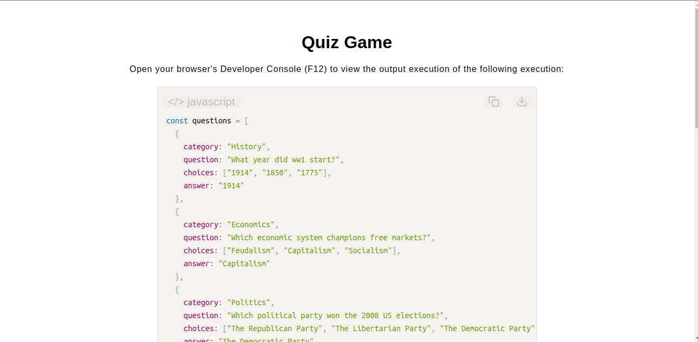

# Quiz Game

[Live Demo](https://tefol-hub.github.io/freeCodeCamp-Projects-and-Certs/Javascript-Certification/quiz-game/)
[Lab Instructions](https://www.freecodecamp.org/learn/javascript-v9/lab-quiz-game/lab-quiz-game)

## 📸 Preview

## 🎯 Project Goals
* **Objective:** Construct a simulation engine that parses collection arrays of structured trivia data objects and judges random computer choices.
* **Complex Data Structures:** Managed composite data layouts consisting of multi-layered nested arrays inside object property fields (`choices`).
* **Decoupled System Functions:** Engineered isolated, modular functions ensuring one clear responsibility per block (e.g., separating general item selection from comparison logic rules).
* **Deep Reference Parsing:** Accessed deep property references via structural dot notation paths (`question.answer`) combined with string template literals for explicit response generation.

## 🛠️ Technologies Used
* **JavaScript (ES6):** Object records, arrays, index math mapping (`Math.random()`), strict type comparison, and template strings.
* **HTML5 & CSS3:** Presentational display scaffolding dashboard layout.
* **Prism.js:** Asynchronous client-side runtime script parsing styling.

## 🚀 How to Run
1. Navigate to: `cd Javascript-Certification/quiz-game`
2. Open `index.html` in your browser.
3. Open your browser's **Developer Console (F12)** and reload to track random question selection iterations and outcome calculations.
