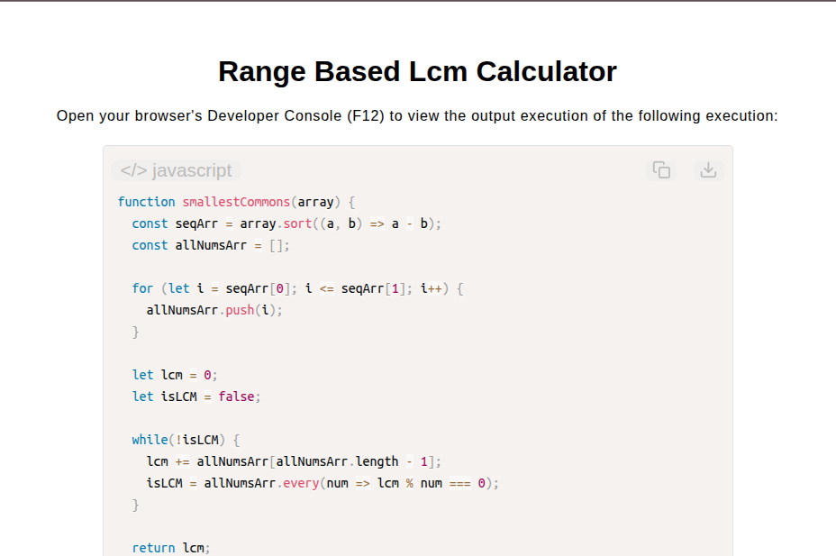

# Range-Based LCM Calculator

[Live Demo](https://tefol-hub.github.io/freeCodeCamp-Projects-and-Certs/Javascript-Certification/range-based-lcm-calculator/)
[Lab Instructions](https://www.freecodecamp.org/learn/javascript-v9/lab-range-based-lcm-calculator/implement-a-range-based-lcm-calculator)

## 📸 Preview

## 🎯 Project Goals
* **Objective:** Compute the Least Common Multiple (LCM) for an inclusive numeric range defined by an unsorted two-element array.
* **Range Normalization:** Sorted initial boundary inputs in ascending order using `Array.prototype.sort()` to guarantee valid range generation.
* **Sequence Expansion:** Constructed an explicit array representing all intermediate integer terms between bounds using `for` loops.
* **Higher-Order Evaluation:** Iteratively incremented test multiples and verified complete divisibility across all sequence terms using `Array.prototype.every()`.

## 🛠️ Technologies Used
* **JavaScript (ES6):** Higher-Order Functions (`.sort()`, `.every()`), mathematical modulo operator, loops, boolean flags.
* **HTML5 & CSS3:** Presentational user display framework.
* **Prism.js:** Automated syntax parsing and client-side code rendering.

## 🚀 How to Run
1. Navigate to: `cd Javascript-Certification/range-based-lcm-calculator`
2. Open `index.html` in your browser.
3. Access your **Developer Console (F12)** to test custom numeric ranges.
