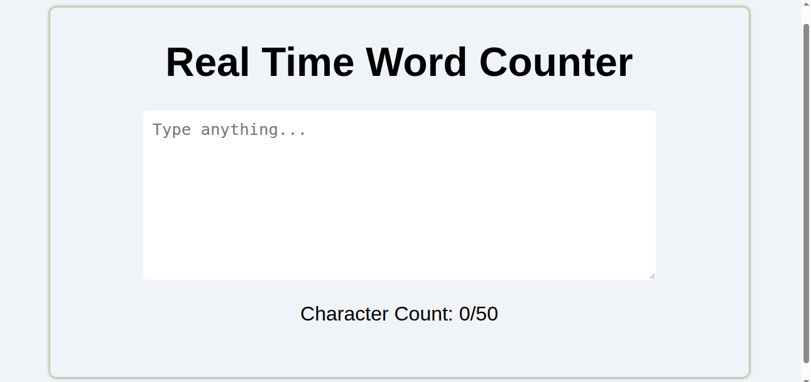

# Real Time Counter

[Live Demo](https://tefol-hub.github.io/freeCodeCamp-Projects-and-Certs/Javascript-Certification/real-time-counter/)
[Lab Instructions](https://www.freecodecamp.org/learn/javascript-v9/lab-real-time-counter/build-a-real-time-counter)

## 📸 Preview

## 🎯 Project Goals
* **Objective:** Build a real-time character input tracker that limits user text entry to 50 characters and dynamically updates feedback metrics without HTML5 `maxlength` attributes.
* **Input Event Listening:** Listened to user keystrokes in real time using the `input` event on a `<textarea>` element.
* **String Trimming & Length Enforcement:** Extracted `event.target.value` length, slicing text over 50 characters (`.slice(0, 50)`) via JavaScript program logic.
* **Dynamic Style & Text Manipulation:** Updated counter metrics via `textContent` and applied conditional inline warning styles when input limits were reached.

## 🛠️ Technologies Used
* **JavaScript (ES6):** DOM selection (`getElementById`), `input` event listeners, template literals, string slicing (`.slice()`), dynamic style mutation.
* **HTML5:** Form controls (`<textarea>`, `<label>`), semantic text markup (`
`).
* **CSS3:** Card UI layout, box shadows, custom font typography, responsive styling.

## 🚀 How to Run
1. Navigate to: `cd Javascript-Certification/real-time-counter`
2. Open `index.html` in your browser.
3. Type into the text area to observe live counter updates and the 50-character limit enforcement.
