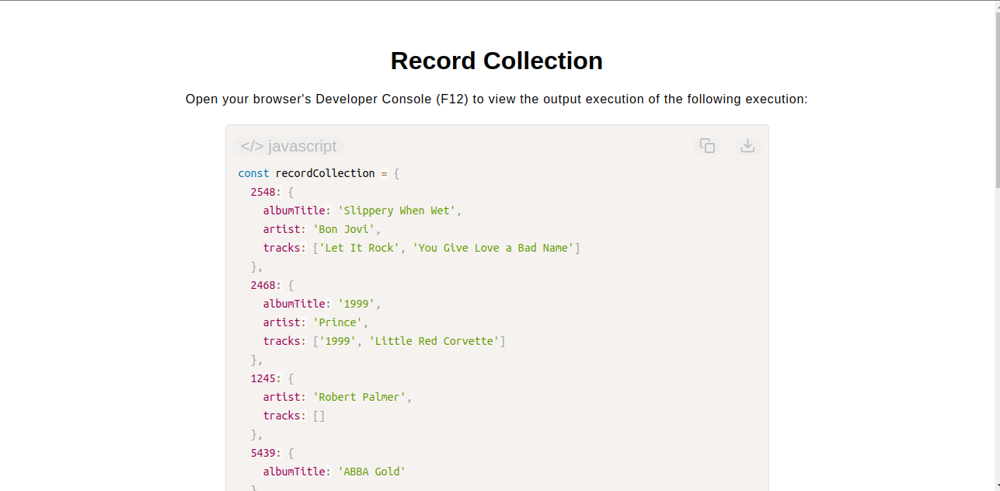

# Record Collection Assistant

[Live Demo](https://tefol-hub.github.io/freeCodeCamp-Projects-and-Certs/Javascript-Certification/record-collection/)
[Lab Instructions](https://www.freecodecamp.org/learn/javascript-v9/lab-record-collection/build-a-record-collection)

## 📸 Preview

## 🎯 Project Goals
* **Objective:** Build a complex dictionary-mutation algorithm capable of safely executing updates, deletions, and structural array initializations inside deeply nested JSON-style object trees.
* **Deep Property Mutation:** Mastered dynamic bracket notation (`records[id][prop]`) to read and overwrite schema values inside deeply nested tracking layers.
* **Property Lifecycle Destruction:** Utilized the JavaScript `delete` keyword operator to prune empty or unset properties dynamically based on data state rules.
* **Safe Array Initialization:** Deployed modern safety lookups via `Object.hasOwn()` to selectively instantiate missing array keys without overwriting existing data matrices.

## 🛠️ Technologies Used
* **JavaScript (ES6):** Nested objects, array mutation operations (`.push()`), existence auditing (`Object.hasOwn()`), key deletion, and conditional control flows.
* **HTML5 & CSS3:** Semantic presentational document dashboard scaffolding.
* **Prism.js:** Automated client-side token parsing syntax styling layout.

## 🚀 How to Run
1. Navigate to: `cd Javascript-Certification/record-collection`
2. Open `index.html` in your browser.
3. Access your **Developer Console (F12)** to observe deep structural transformations and property creations across track records.
