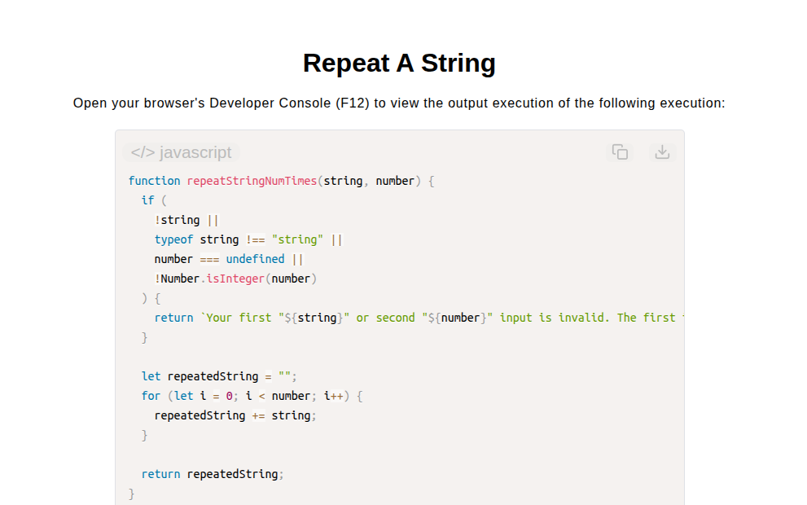

# Repeat a String

[Live Demo](https://tefol-hub.github.io/freeCodeCamp-Projects-and-Certs/Javascript-Certification/repeat-a-string/)
[Lab Instructions](https://www.freecodecamp.org/learn/javascript-v9/lab-repeat-a-string/build-a-string-repeating-function)

## 📸 Preview

## 🎯 Project Goals
* **Objective:** Recreate core string repetition functionality without relying on native utility methods (`String.prototype.repeat()`).
* **Iterative String Accumulation:** Used a standard `for` loop combined with addition assignment operators (`+=`) to concatenate string tokens across bounded iterations.
* **Non-Positive Boundary Handling:** Allowed loop exit conditions (`i < number`) to naturally resolve zero or negative count inputs to empty string outputs (`""`).
* **Defensive Parameter Auditing:** Verified string arguments and validated numeric integer inputs to guard against invalid execution calls.

## 🛠️ Technologies Used
* **JavaScript (ES6):** String concatenation, bounded loops (`for`), integer verification (`Number.isInteger`), and condition handling.
* **HTML5 & CSS3:** Presentational user interface layout.
* **Prism.js:** Automated client-side token parsing and source rendering.

## 🚀 How to Run
1. Navigate to: `cd Javascript-Certification/repeat-a-string`
2. Open `index.html` in your browser.
3. Access your **Developer Console (F12)** to test custom string inputs and iteration counts.
