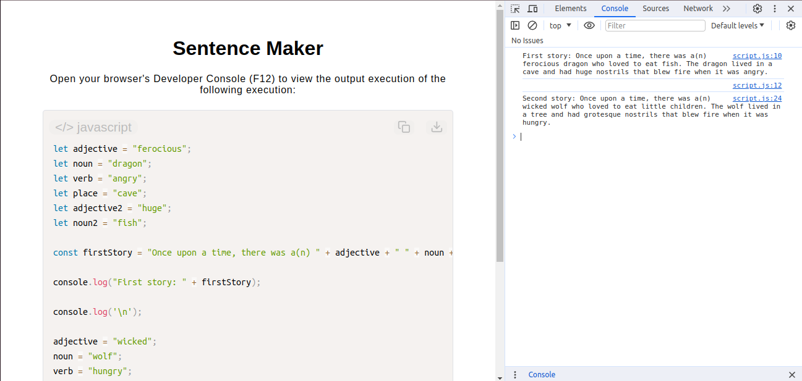

# Sentence Maker

[Live Demo](https://tefol-hub.github.io/freeCodeCamp-Projects-and-Certs/Javascript-Certification/sentence-maker/)
[Lab Instructions](https://www.freecodecamp.org/learn/javascript-v9/lab-sentence-maker/build-a-sentence-maker)

## 📸 Preview

## 🎯 Project Goals
* **Objective:** Practice dynamic string generation and variable reassignability using JavaScript.
* **Variable Reassignment:** Utilized `let` to bind structural Mad-Libs data keys, updating values mid-execution to generate distinctly unique string content using the same logical footprint.
* **String Templates:** Assembled multiple component variables dynamically with strings via basic additive evaluation.
* **Metadata & SEO:** Enhanced the template layer with comprehensive Open Graph and Twitter Card structural metadata configurations to support clean preview rendering across platforms.

## 🛠️ Technologies Used
* **JavaScript (ES6):** Variable state mutation and structural string formatting.
* **HTML5 & CSS3:** Responsive scaffolding and presentation layer.
* **Prism.js:** Client-side source rendering and code highlighting utilities.

## 🚀 How to Run
1. Navigate to: `cd JavaScript-Certification/sentence-maker`
2. Open `index.html` in your browser.
3. Access your **Developer Console (F12)** to inspect the live generated console-log stories.
