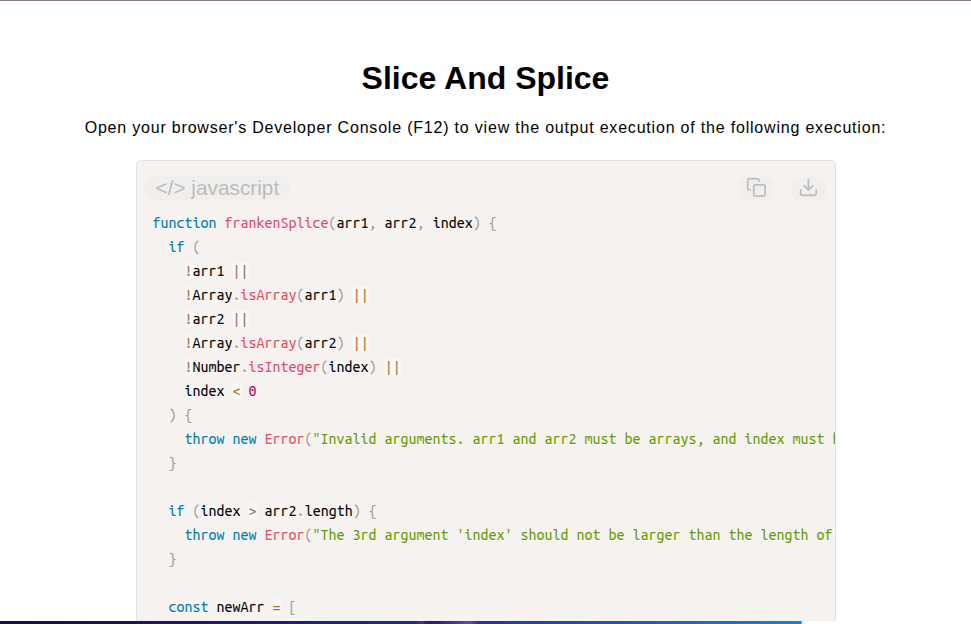

# Slice and Splice Algorithm

[Live Demo](https://tefol-hub.github.io/freeCodeCamp-Projects-and-Certs/Javascript-Certification/slice-and-splice/)
[Lab Instructions](https://www.freecodecamp.org/learn/javascript-v9/lab-slice-and-splice/implement-the-slice-and-splice-algorithm)

## 📸 Preview

## 🎯 Project Goals
* **Objective:** Splice elements from a source array into a target array at a specified index offset without mutating either input array.
* **Immutable Array Composition:** Combined non-mutating `.slice()` extraction with array spread syntax (`[...]`) to construct a fresh output array.
* **Pure Function Guarantees:** Ensured input parameter integrity by avoiding mutating array methods like native `.splice()`.
* **Index & Type Guarding:** Implemented error boundary assertions verifying array parameters and target index ranges.

## 🛠️ Technologies Used
* **JavaScript (ES6):** Array spread operator (`...`), `.slice()`, array type assertions (`Array.isArray()`), exception handling (`throw new Error()`).
* **HTML5 & CSS3:** Presentational user display framework.
* **Prism.js:** Automated syntax parsing and client-side code rendering.

## 🚀 How to Run
1. Navigate to: `cd Javascript-Certification/slice-and-splice`
2. Open `index.html` in your browser.
3. Access your **Developer Console (F12)** to test custom insertion indices and array compositions.
