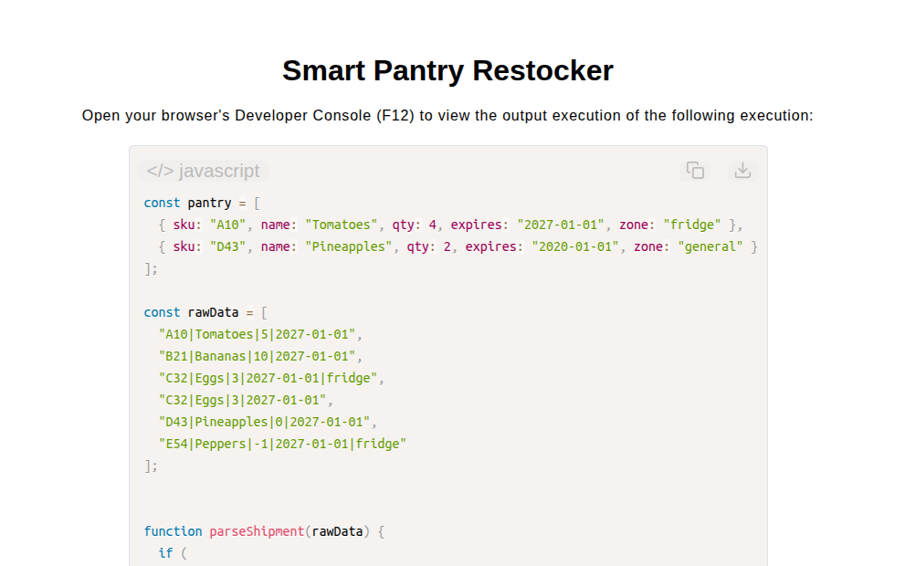

# Smart Pantry Restocker

[Live Demo](https://tefol-hub.github.io/freeCodeCamp-Projects-and-Certs/Javascript-Certification/smart-pantry-restocker/)
[Lab Instructions](https://www.freecodecamp.org/learn/javascript-v9/lab-smart-pantry-restocker/lab-smart-pantry-restocker)

## 📸 Preview

## 🎯 Project Goals
* **Objective:** Implement an end-to-end inventory management pipeline to parse raw pipe-delimited shipment data, evaluate restock/discard/donate inventory rules, deep clone state, and organize actions by physical storage zones.
* **Pipe-Delimited Data Parsing:** Tokenized raw shipment strings using `.split("|")` and default destructuring parameters (`zone = "general"`) to construct structured inventory objects while filtering duplicate SKU entries.
* **State Deep Copying:** Isolated original pantry records from pipeline mutations by generating fresh object clones across array iterations.
* **Inventory Rule Evaluation & Grouping:** Classified items into action types based on quantity thresholds and pantry presence, accumulating final actions into dynamic zone-keyed dictionary objects using `Object.hasOwn()`.

## 🛠️ Technologies Used
* **JavaScript (ES6):** Array destructuring, string parsing (`.split()`), object cloning (`{ ...item }`), dynamic key assignment, and modular functional pipelines.
* **HTML5 & CSS3:** Presentational user display framework.
* **Prism.js:** Automated syntax parsing and client-side code rendering.

## 🚀 How to Run
1. Navigate to: `cd Javascript-Certification/smart-pantry-restocker`
2. Open `index.html` in your browser.
3. Access your **Developer Console (F12)** to test raw shipment batch processing and dynamic zone aggregation.
