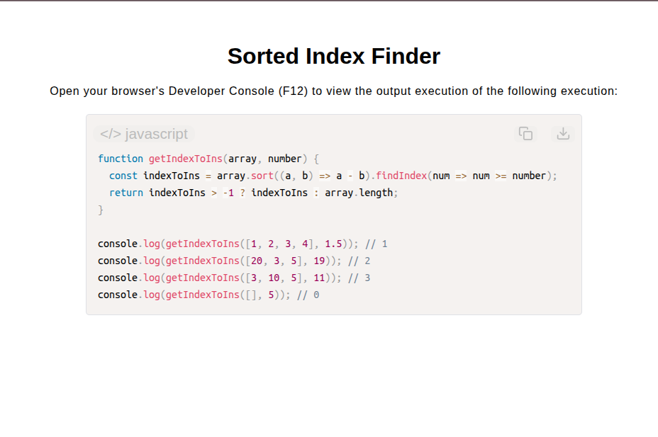

# Sorted Index Finder

[Live Demo](https://tefol-hub.github.io/freeCodeCamp-Projects-and-Certs/Javascript-Certification/sorted-index-finder/)
[Lab Instructions](https://www.freecodecamp.org/learn/javascript-v9/lab-sorted-index-finder/lab-sorted-index-finder)

## 📸 Preview

## 🎯 Project Goals
* **Objective:** Determine the lowest insertion index for a target number within an array once organized in ascending numeric sequence.
* **Higher-Order Sorting:** Applied `Array.prototype.sort()` with a custom numeric subtraction comparator `(a, b) => a - b` to prevent lexicographical sorting bugs.
* **Higher-Order Search:** Leveraged `Array.prototype.findIndex()` with a predicate callback `num => num >= number` to isolate the insertion point.
* **Fallback Boundary Handling:** Managed edge cases where `findIndex()` returned `-1` by falling back to `array.length` for values exceeding all array entries.

## 🛠️ Technologies Used
* **JavaScript (ES6):** Higher-order methods (`.sort()`, `.findIndex()`), arrow functions, ternary operators.
* **HTML5 & CSS3:** Presentational user display framework.
* **Prism.js:** Automated syntax parsing and client-side code rendering.

## 🚀 How to Run
1. Navigate to: `cd Javascript-Certification/sorted-index-finder`
2. Open `index.html` in your browser.
3. Access your **Developer Console (F12)** to test custom numeric arrays and target insertion values.
