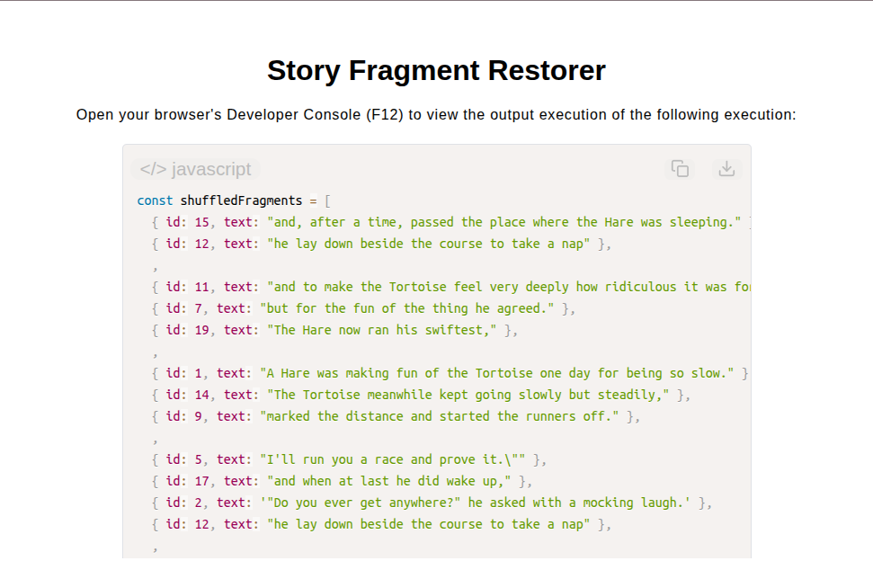

# Story Fragment Restorer

[Live Demo](https://tefol-hub.github.io/freeCodeCamp-Projects-and-Certs/Javascript-Certification/story-fragment-restorer/)
[Lab Instructions](https://www.freecodecamp.org/learn/javascript-v9/lab-restore-a-coherent-narrative-from-an-array-of-story-fragments/restore-a-coherent-narrative-from-an-array-of-story-fragments)

## 📸 Preview

## 🎯 Project Goals
* **Objective:** Clean, sort, deduplicate, fill missing sequence gaps, and reassemble corrupted story fragment objects into a cohesive narrative string.
* **Stable Manual Sorting:** Implemented stable Bubble Sort without using native `Array.prototype.sort()` to preserve original order among duplicate IDs.
* **Array Compaction & Deduplication:** Filtered sparse array slots and removed duplicate records using ID tracking arrays (`uniqueIDs.includes()`).
* **Sequence Gap Filling:** Detected missing numeric IDs within contiguous ranges and injected formatted placeholder objects (`{ id, text: "[...]" }`).
* **Immutable Pipeline Operations:** Built pure functional pipeline steps that return new collection structures without mutating original fragment inputs.

## 🛠️ Technologies Used
* **JavaScript (ES6):** Array spread operator (`...`), `.splice()`, loop iteration routines, object immutability, console logging alerts.
* **HTML5 & CSS3:** Presentational user display framework.
* **Prism.js:** Automated syntax parsing and client-side code rendering.

## 🚀 How to Run
1. Navigate to: `cd Javascript-Certification/story-fragment-restorer`
2. Open `index.html` in your browser.
3. Access your **Developer Console (F12)** to inspect pipeline transformation stages and view logging prefixes (`[COMPACTED]`, `[DEDUPED]`, `[FILLED]`).
