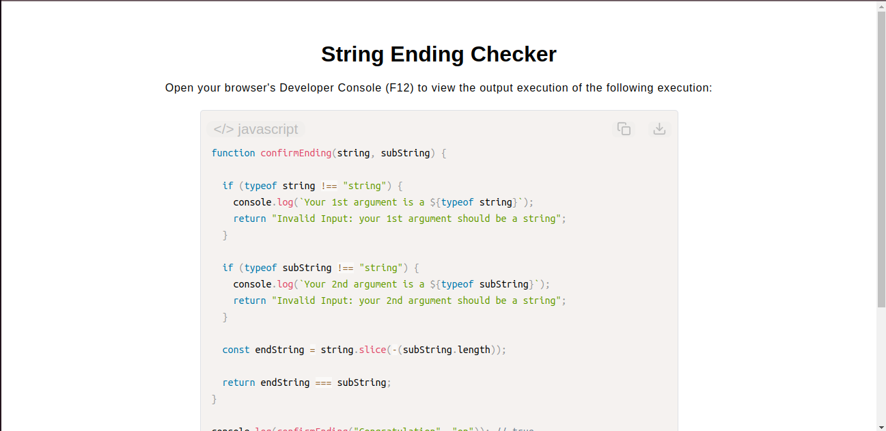

# Confirm the Ending Tool

[Live Demo](https://tefol-hub.github.io/freeCodeCamp-Projects-and-Certs/Javascript-Certification/string-ending-checker/)
[Lab Instructions](https://www.freecodecamp.org/learn/javascript-v9/lab-string-ending-checker/implement-a-string-ending-checker-function)

## 📸 Preview

## 🎯 Project Goals
* **Objective:** Implement a suffix-matching text analyzer that verifies if a string terminates with an explicit target substring without relying on the native `.endsWith()` method.
* **Negative Slicing Mechanics:** Mastered backward index tracking by supplying negative parameters (`-(subString.length)`) into `.slice()` to harvest trailing segments dynamically.
* **Type Validation Guards:** Maintained type-safe constraints by using strict `typeof` validations to intercept non-string values before execution.

## 🛠️ Technologies Used
* **JavaScript (ES6):** Substring slicing (`.slice()`), strict type auditing (`typeof`), equality operators, and variable handling.
* **HTML5 & CSS3:** Presentational display dashboard layout.
* **Prism.js:** Client-side runtime script highlighting utility.

## 🚀 How to Run
1. Navigate to: `cd Javascript-Certification/string-ending-checker`
2. Open `index.html` in your browser.
3. Launch the **Developer Console (F12)** to test custom target words against long sentence strings.
