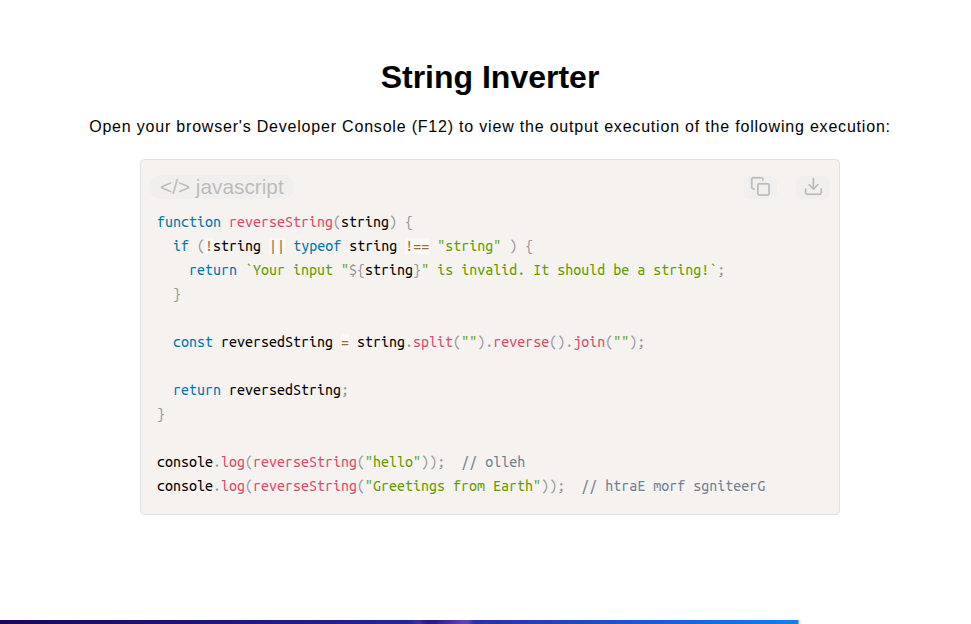

# String Inverter

[Live Demo](https://tefol-hub.github.io/freeCodeCamp-Projects-and-Certs/Javascript-Certification/string-inverter/)
[Lab Instructions](https://www.freecodecamp.org/learn/javascript-v9/lab-reverse-a-string/build-a-string-inverter)

## 📸 Preview

## 🎯 Project Goals
* **Objective:** Reverse the character order of a given input string.
* **Method Chaining Pipeline:** Transformed input strings into character arrays (`.split("")`), mutated element positions in-place (`.reverse()`), and reassembled final strings (`.join("")`).
* **Defensive Guarding:** Verified argument types using `typeof` comparisons to ensure non-string primitives are handled cleanly.

## 🛠️ Technologies Used
* **JavaScript (ES6):** Array conversion (`String.prototype.split()`), array mutation (`Array.prototype.reverse()`), string reassembly (`Array.prototype.join()`), and type validation.
* **HTML5 & CSS3:** Presentational user display framework.
* **Prism.js:** Automated syntax parsing and client-side code rendering.

## 🚀 How to Run
1. Navigate to: `cd Javascript-Certification/string-inverter`
2. Open `index.html` in your browser.
3. Access your **Developer Console (F12)** to test custom string inversion queries.
